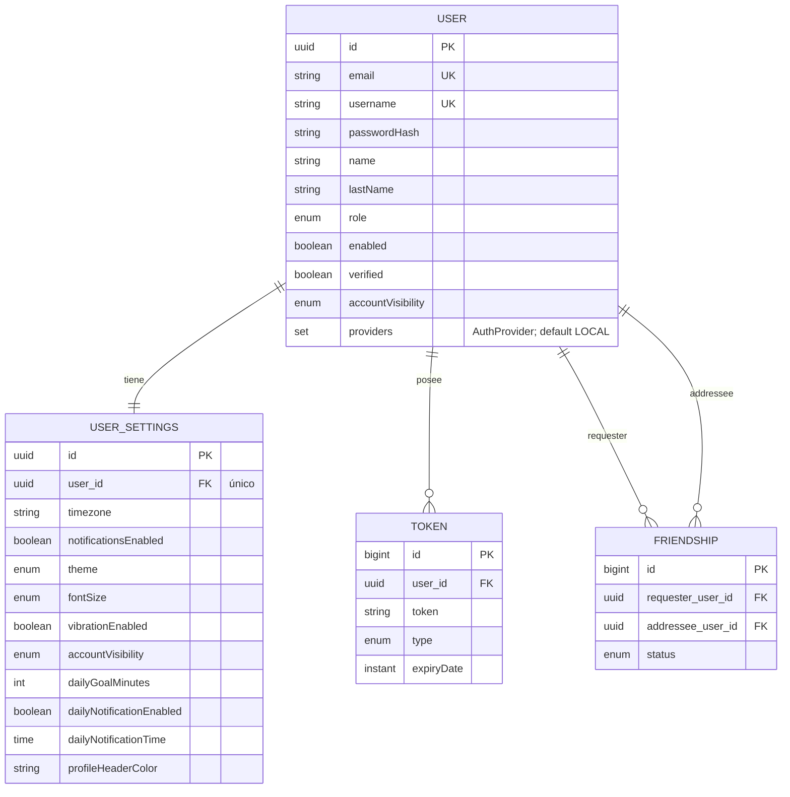
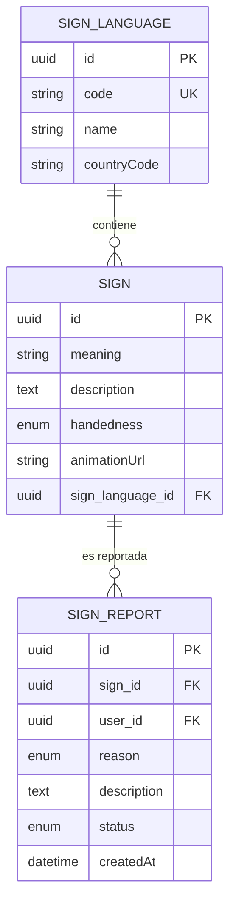
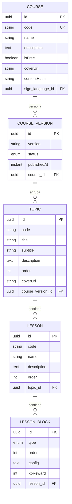
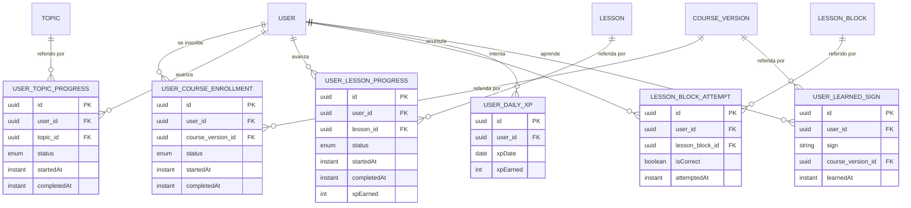
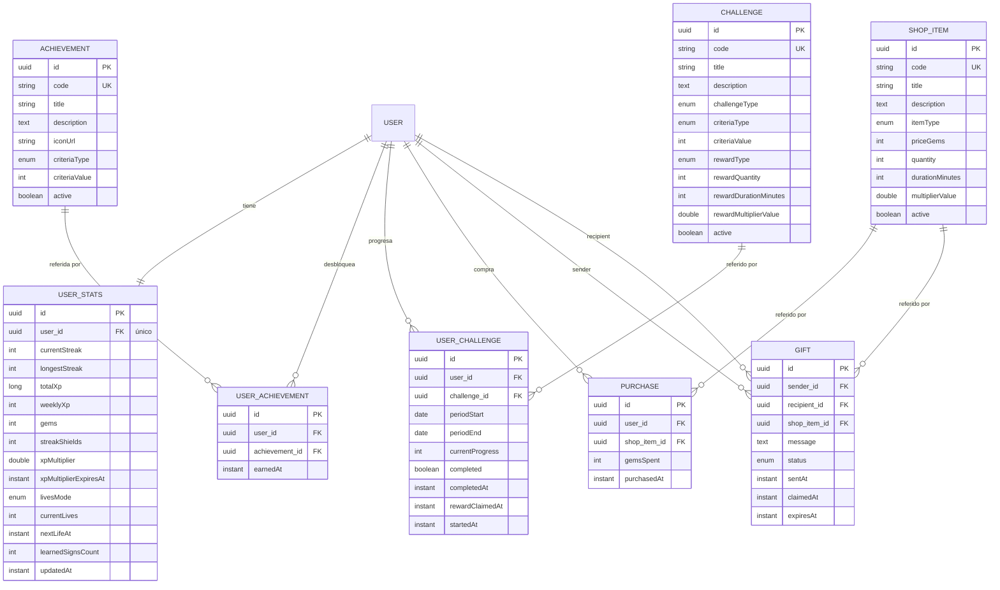
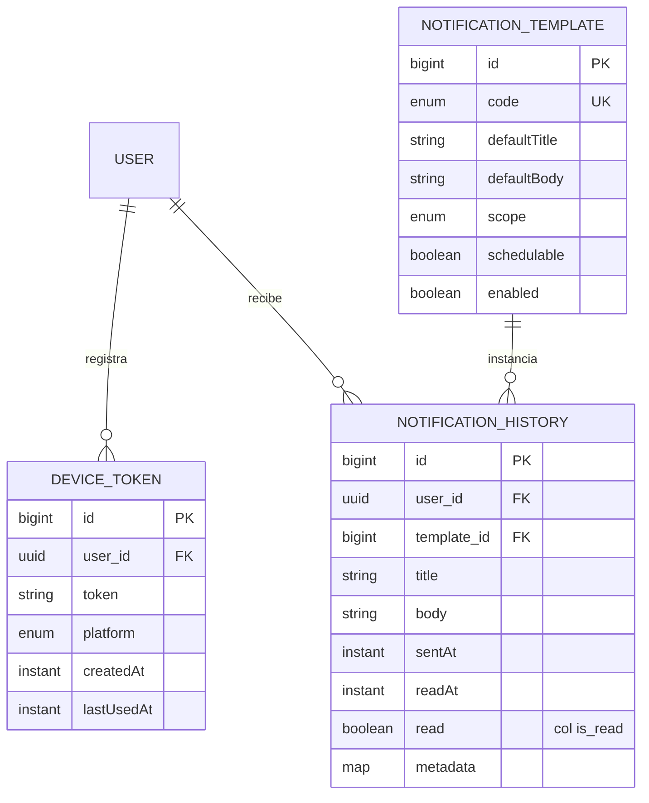

# Diagrama Entidad-Relación

Modelo de datos completo: las entidades del sistema y sus relaciones. Se agrupa en vistas
temáticas para facilitar la lectura.

## Usuarios

Perfil, settings, tokens y amistades.

## Señas

Catálogo de señas por lengua y sus reportes. `SIGN_REPORT.user_id` referencia a `USER` (vista
[Usuarios](#usuarios)).

## Contenido / aprendizaje

Cursos, versiones y su jerarquía. `COURSE.sign_language_id` referencia a `SIGN_LANGUAGE` (vista
[Señas](#senas)).

## Progreso / seguimiento

Registro del avance de cada usuario sobre la jerarquía de contenido, más el XP diario y las señas
aprendidas. `USER` es la vista [Usuarios](#usuarios); `COURSE_VERSION`, `TOPIC`, `LESSON` y
`LESSON_BLOCK`, la vista [Contenido / aprendizaje](#contenido-aprendizaje). `USER_LEARNED_SIGN.sign`
guarda la seña como texto (no es FK a `SIGN`).

## Gamificación

`USER_STATS` es el inventario/estado del jugador (gemas, escudos de racha, vidas, multiplicador de XP,
rachas y XP). `ACHIEVEMENT` es el catálogo de logros; `USER_ACHIEVEMENT` registra los que un usuario
desbloqueó (con `earnedAt`).

## Notificaciones

