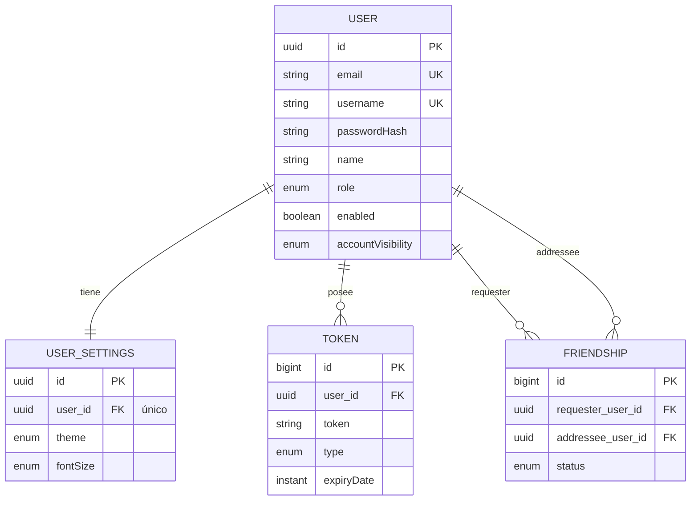
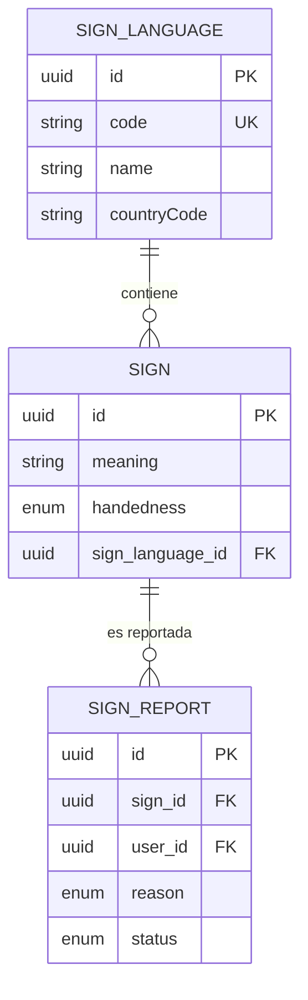
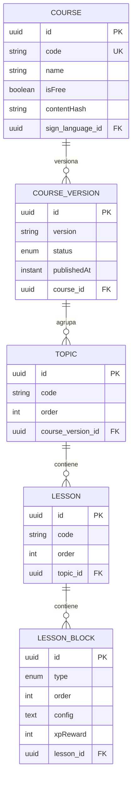
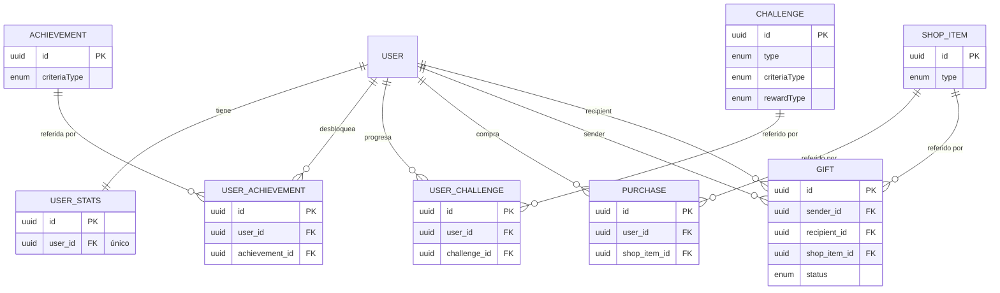
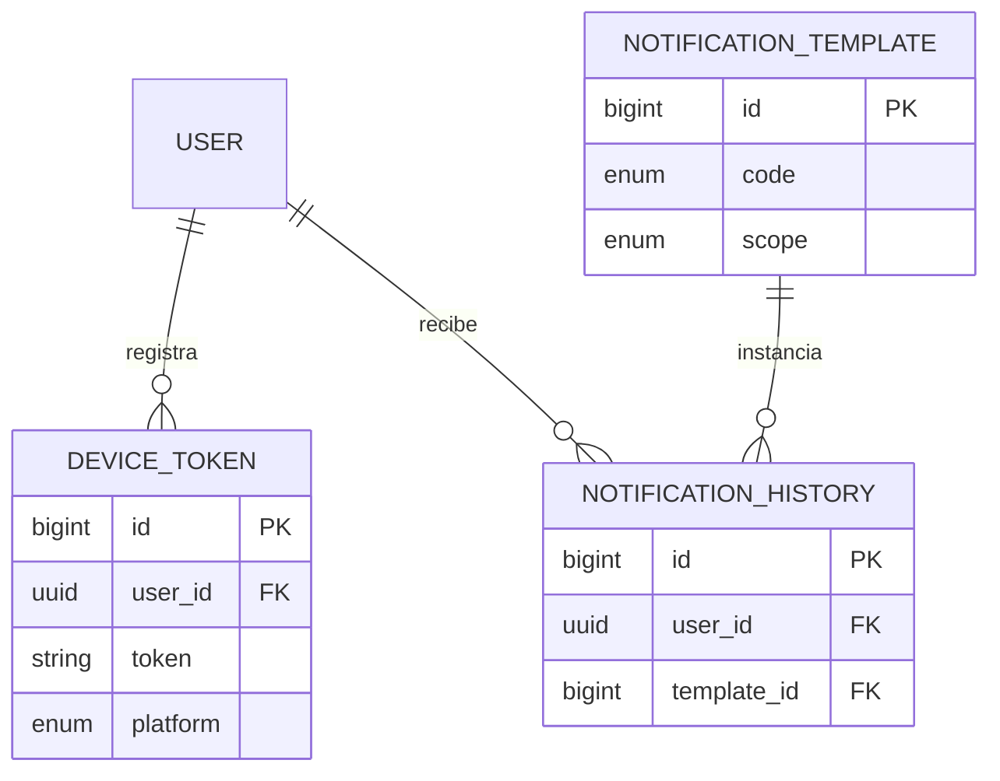

# Diagrama Entidad-Relación

Modelo de datos completo: las entidades del sistema y sus relaciones. Se agrupa en vistas
temáticas para facilitar la lectura.

## Usuarios

Perfil, settings, tokens y amistades.

## Señas

Catálogo de señas por lengua y sus reportes. `SIGN_REPORT.user_id` referencia a `USER` (vista
[Usuarios](#usuarios)).

## Contenido / aprendizaje

Cursos, versiones y su jerarquía. `COURSE.sign_language_id` referencia a `SIGN_LANGUAGE` (vista
[Señas](#señas)).

## Gamificación

## Notificaciones

