# Diagramas de secuencia

Flujos dinámicos de los casos de uso principales, descritos a nivel de responsabilidades (no de
componentes concretos del código).

## Registro de usuario

```mermaid
sequenceDiagram
    autonumber
    participant C as Cliente
    participant API as API
    participant DB as Base de datos
    participant Mail as Servicio de correo

    C->>API: Solicitud de registro
    API->>DB: ¿Correo o usuario ya registrados?
    alt ya existe
        API-->>C: Conflicto (409)
    else disponible
        API->>DB: Crear cuenta (activa, correo sin verificar, contraseña cifrada)
        API->>DB: Generar token de verificación
        API->>Mail: Enviar correo de verificación
        API->>API: Emitir token de acceso
        API->>DB: Generar token de renovación
        API-->>C: Registro exitoso + tokens (sesión iniciada; verificar correo es opcional)
    end
```

## Inicio de sesión

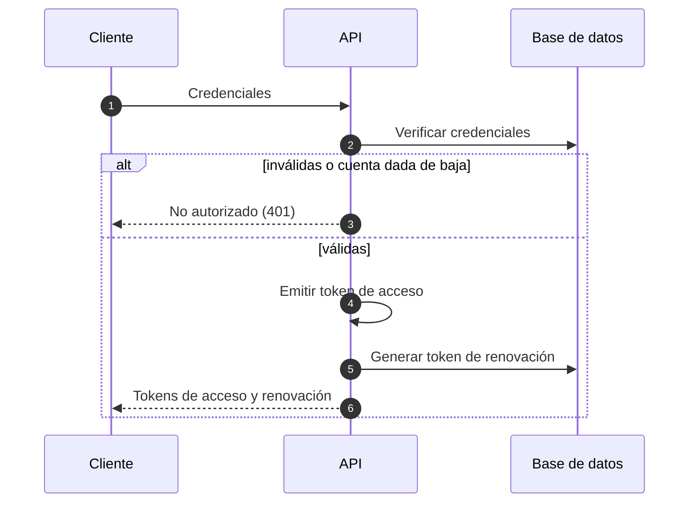
```mermaid
sequenceDiagram
    autonumber
    participant C as Cliente
    participant API as API
    participant DB as Base de datos

    C->>API: Credenciales
    API->>DB: Verificar credenciales
    alt inválidas o cuenta dada de baja
        API-->>C: No autorizado (401)
    else válidas
        API->>API: Emitir token de acceso
        API->>DB: Generar token de renovación
        API-->>C: Tokens de acceso y renovación
    end
```

## Petición autenticada

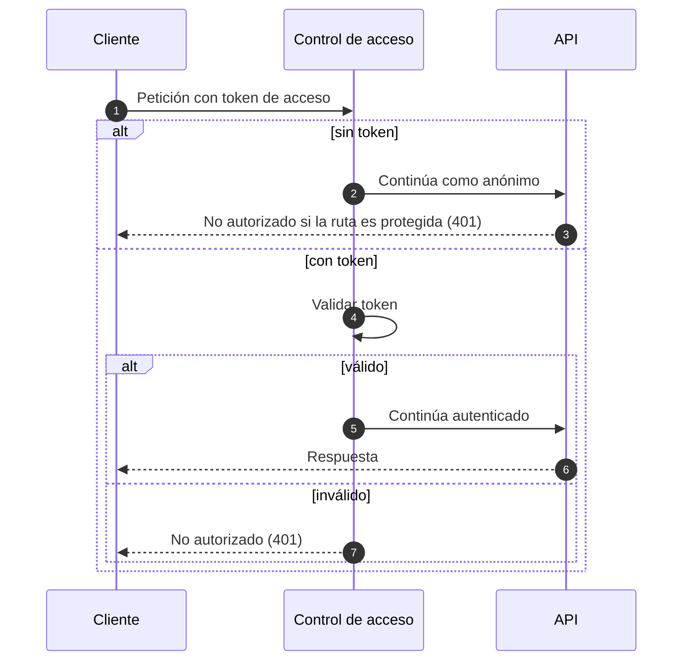
```mermaid
sequenceDiagram
    autonumber
    participant C as Cliente
    participant Auth as Control de acceso
    participant API as API

    C->>Auth: Petición con token de acceso
    alt sin token
        Auth->>API: Continúa como anónimo
        API-->>C: No autorizado si la ruta es protegida (401)
    else con token
        Auth->>Auth: Validar token
        alt válido
            Auth->>API: Continúa autenticado
            API-->>C: Respuesta
        else inválido
            Auth-->>C: No autorizado (401)
        end
    end
```

## Renovación de token (rotación)

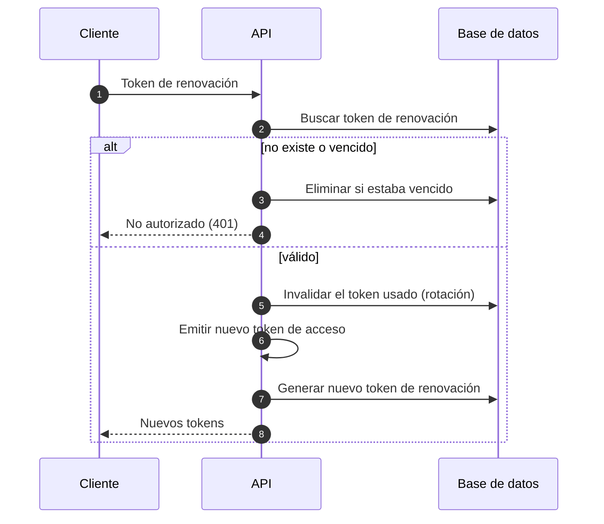
```mermaid
sequenceDiagram
    autonumber
    participant C as Cliente
    participant API as API
    participant DB as Base de datos

    C->>API: Token de renovación
    API->>DB: Buscar token de renovación
    alt no existe o vencido
        API->>DB: Eliminar si estaba vencido
        API-->>C: No autorizado (401)
    else válido
        API->>DB: Invalidar el token usado (rotación)
        API->>API: Emitir nuevo token de acceso
        API->>DB: Generar nuevo token de renovación
        API-->>C: Nuevos tokens
    end
```

## Inicio de sesión con proveedor externo

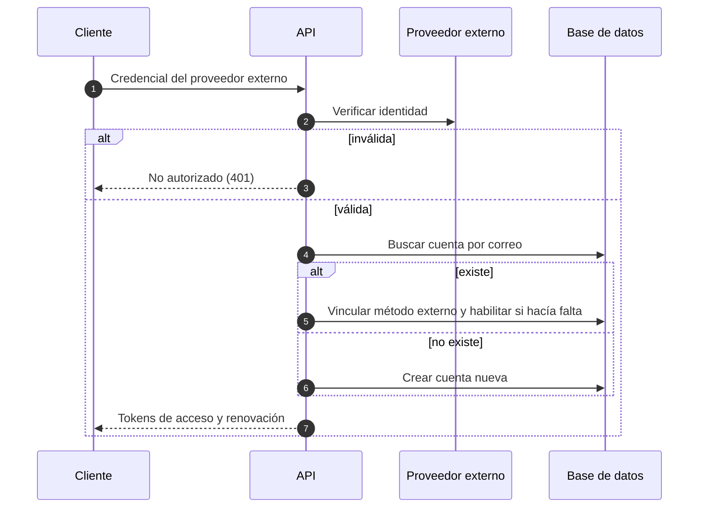
```mermaid
sequenceDiagram
    autonumber
    participant C as Cliente
    participant API as API
    participant OAuth as Proveedor externo
    participant DB as Base de datos

    C->>API: Credencial del proveedor externo
    API->>OAuth: Verificar identidad
    alt inválida
        API-->>C: No autorizado (401)
    else válida
        API->>DB: Buscar cuenta por correo
        alt existe
            API->>DB: Vincular método externo y habilitar si hacía falta
        else no existe
            API->>DB: Crear cuenta nueva
        end
        API-->>C: Tokens de acceso y renovación
    end
```

## Envío de notificación push

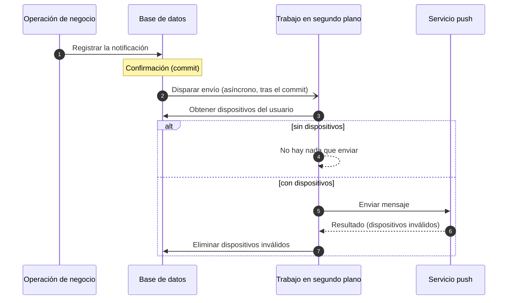
```mermaid
sequenceDiagram
    autonumber
    participant Op as Operación de negocio
    participant DB as Base de datos
    participant Bg as Trabajo en segundo plano
    participant Push as Servicio push

    Op->>DB: Registrar la notificación
    Note over DB: Confirmación (commit)
    DB-)Bg: Disparar envío (asíncrono, tras el commit)
    Bg->>DB: Obtener dispositivos del usuario
    alt sin dispositivos
        Bg-->>Bg: No hay nada que enviar
    else con dispositivos
        Bg->>Push: Enviar mensaje
        Push-->>Bg: Resultado (dispositivos inválidos)
        Bg->>DB: Eliminar dispositivos inválidos
    end
```

## Consulta de logros e inventario

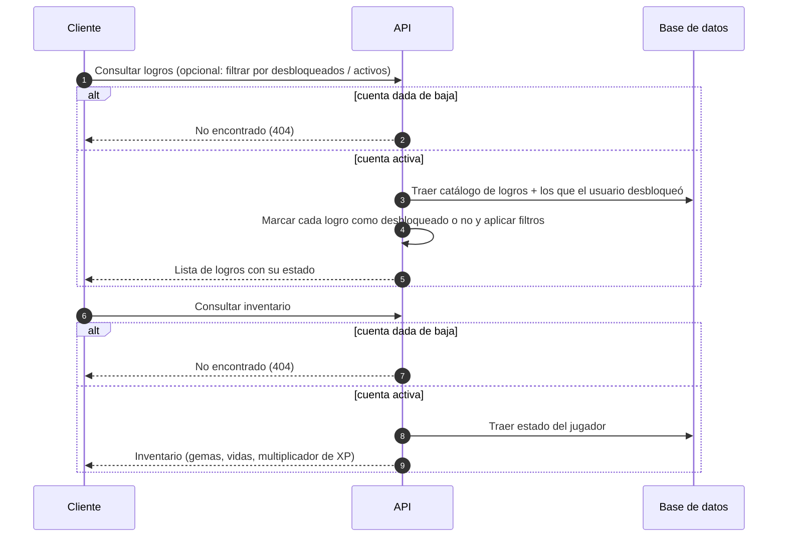
```mermaid
sequenceDiagram
    autonumber
    participant C as Cliente
    participant API as API
    participant DB as Base de datos

    C->>API: Consultar logros (opcional: filtrar por desbloqueados / activos)
    alt cuenta dada de baja
        API-->>C: No encontrado (404)
    else cuenta activa
        API->>DB: Traer catálogo de logros + los que el usuario desbloqueó
        API->>API: Marcar cada logro como desbloqueado o no y aplicar filtros
        API-->>C: Lista de logros con su estado
    end

    C->>API: Consultar inventario
    alt cuenta dada de baja
        API-->>C: No encontrado (404)
    else cuenta activa
        API->>DB: Traer estado del jugador
        API-->>C: Inventario (gemas, vidas, multiplicador de XP)
    end
```

## Consulta de progreso de cursos

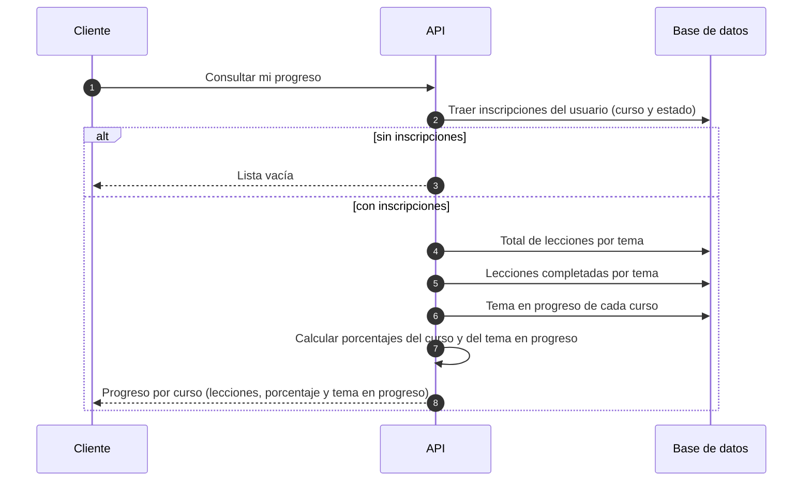
```mermaid
sequenceDiagram
    autonumber
    participant C as Cliente
    participant API as API
    participant DB as Base de datos

    C->>API: Consultar mi progreso
    API->>DB: Traer inscripciones del usuario (curso y estado)
    alt sin inscripciones
        API-->>C: Lista vacía
    else con inscripciones
        API->>DB: Total de lecciones por tema
        API->>DB: Lecciones completadas por tema
        API->>DB: Tema en progreso de cada curso
        API->>API: Calcular porcentajes del curso y del tema en progreso
        API-->>C: Progreso por curso (lecciones, porcentaje y tema en progreso)
    end
```

## Recorrido de un curso (roadmap)

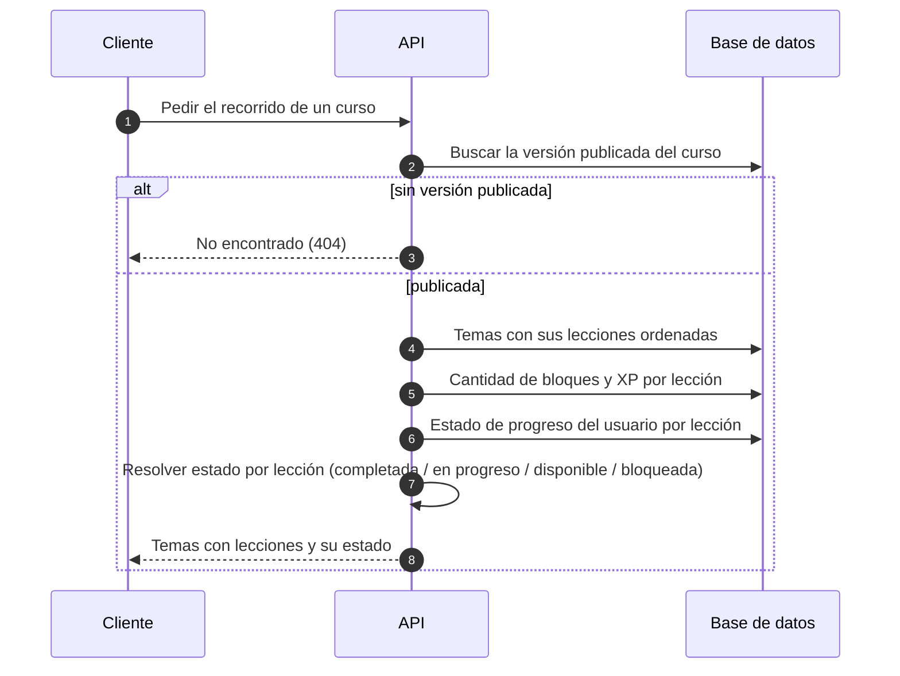
```mermaid
sequenceDiagram
    autonumber
    participant C as Cliente
    participant API as API
    participant DB as Base de datos

    C->>API: Pedir el recorrido de un curso
    API->>DB: Buscar la versión publicada del curso
    alt sin versión publicada
        API-->>C: No encontrado (404)
    else publicada
        API->>DB: Temas con sus lecciones ordenadas
        API->>DB: Cantidad de bloques y XP por lección
        API->>DB: Estado de progreso del usuario por lección
        API->>API: Resolver estado por lección (completada / en progreso / disponible / bloqueada)
        API-->>C: Temas con lecciones y su estado
    end
```

## Inscripción a un curso

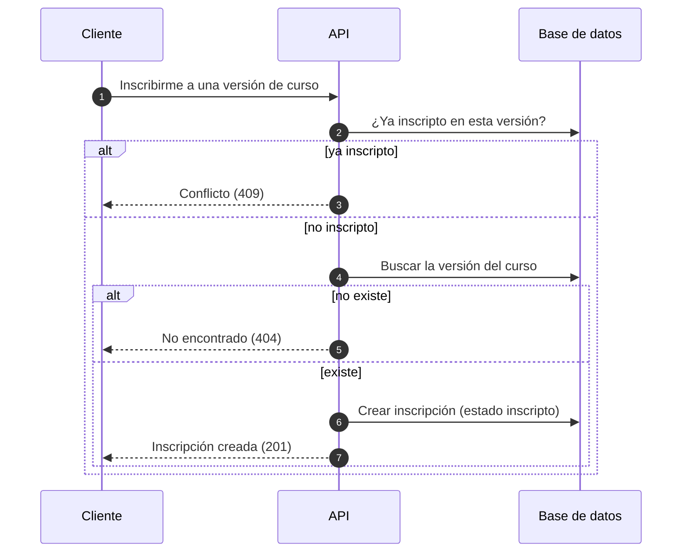
```mermaid
sequenceDiagram
    autonumber
    participant C as Cliente
    participant API as API
    participant DB as Base de datos

    C->>API: Inscribirme a una versión de curso
    API->>DB: ¿Ya inscripto en esta versión?
    alt ya inscripto
        API-->>C: Conflicto (409)
    else no inscripto
        API->>DB: Buscar la versión del curso
        alt no existe
            API-->>C: No encontrado (404)
        else existe
            API->>DB: Crear inscripción (estado inscripto)
            API-->>C: Inscripción creada (201)
        end
    end
```

## Interacción con un bloque de lección

Registra el intento del usuario y propaga la finalización hacia arriba en la jerarquía
(lección → tema → curso). El XP y demás recompensas de gamificación se disparan por eventos, fuera
del camino principal. El progreso de lección y tema se crea de forma diferida en la primera
interacción.

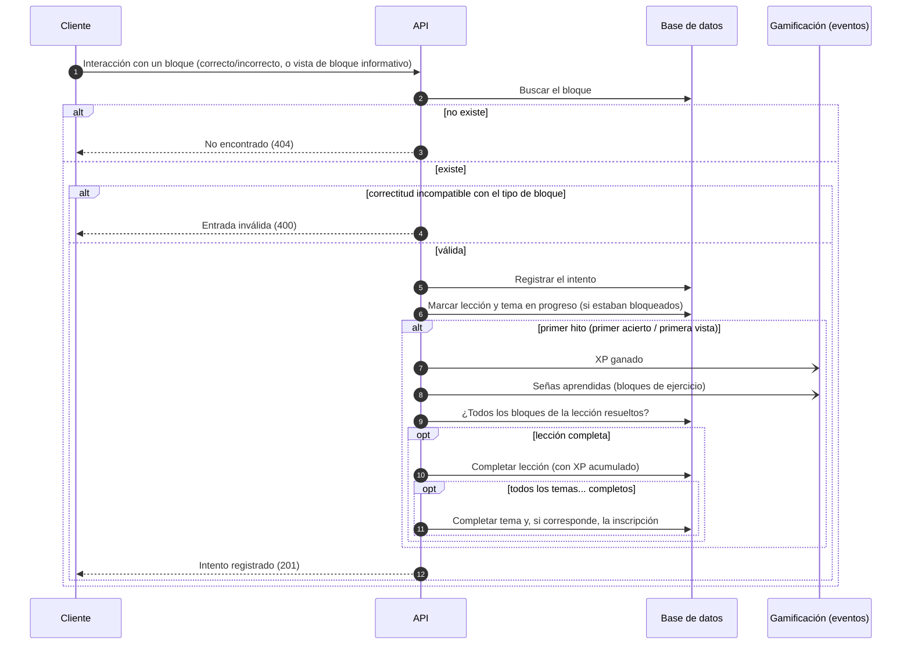
```mermaid
sequenceDiagram
    autonumber
    participant C as Cliente
    participant API as API
    participant DB as Base de datos
    participant Gam as Gamificación (eventos)

    C->>API: Interacción con un bloque (correcto/incorrecto, o vista de bloque informativo)
    API->>DB: Buscar el bloque
    alt no existe
        API-->>C: No encontrado (404)
    else existe
        alt correctitud incompatible con el tipo de bloque
            API-->>C: Entrada inválida (400)
        else válida
            API->>DB: Registrar el intento
            API->>DB: Marcar lección y tema en progreso (si estaban bloqueados)
            alt primer hito (primer acierto / primera vista)
                API-)Gam: XP ganado
                API-)Gam: Señas aprendidas (bloques de ejercicio)
                API->>DB: ¿Todos los bloques de la lección resueltos?
                opt lección completa
                    API->>DB: Completar lección (con XP acumulado)
                    opt todos los temas... completos
                        API->>DB: Completar tema y, si corresponde, la inscripción
                    end
                end
            end
            API-->>C: Intento registrado (201)
        end
    end
```

## Tienda: compra para uno mismo o como regalo

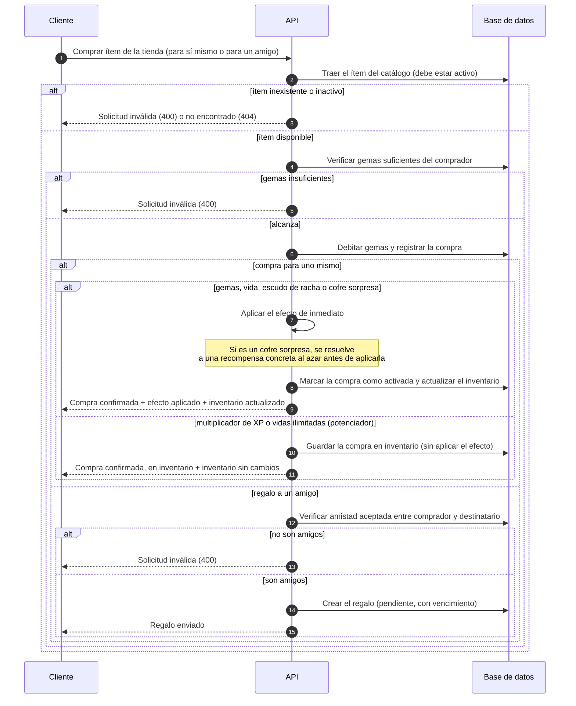
```mermaid
sequenceDiagram
    autonumber
    participant C as Cliente
    participant API as API
    participant DB as Base de datos

    C->>API: Comprar ítem de la tienda (para sí mismo o para un amigo)
    API->>DB: Traer el ítem del catálogo (debe estar activo)
    alt ítem inexistente o inactivo
        API-->>C: Solicitud inválida (400) o no encontrado (404)
    else ítem disponible
        API->>DB: Verificar gemas suficientes del comprador
        alt gemas insuficientes
            API-->>C: Solicitud inválida (400)
        else alcanza
            API->>DB: Debitar gemas y registrar la compra
            alt compra para uno mismo
                alt gemas, vida, escudo de racha o cofre sorpresa
                    API->>API: Aplicar el efecto de inmediato
                    Note over API: Si es un cofre sorpresa, se resuelve<br/>a una recompensa concreta al azar antes de aplicarla
                    API->>DB: Marcar la compra como activada y actualizar el inventario
                    API-->>C: Compra confirmada + efecto aplicado + inventario actualizado
                else multiplicador de XP o vidas ilimitadas (potenciador)
                    API->>DB: Guardar la compra en inventario (sin aplicar el efecto)
                    API-->>C: Compra confirmada, en inventario + inventario sin cambios
                end
            else regalo a un amigo
                API->>DB: Verificar amistad aceptada entre comprador y destinatario
                alt no son amigos
                    API-->>C: Solicitud inválida (400)
                else son amigos
                    API->>DB: Crear el regalo (pendiente, con vencimiento)
                    API-->>C: Regalo enviado
                end
            end
        end
    end
```

## Obtención de la animación de una seña

La API firma una URL de descarga temporal contra el almacenamiento de objetos usando sus
credenciales privadas; el cliente nunca las recibe, sólo la URL, que expira a los pocos minutos. El
archivo se descarga directamente desde el almacenamiento, sin pasar por la API.

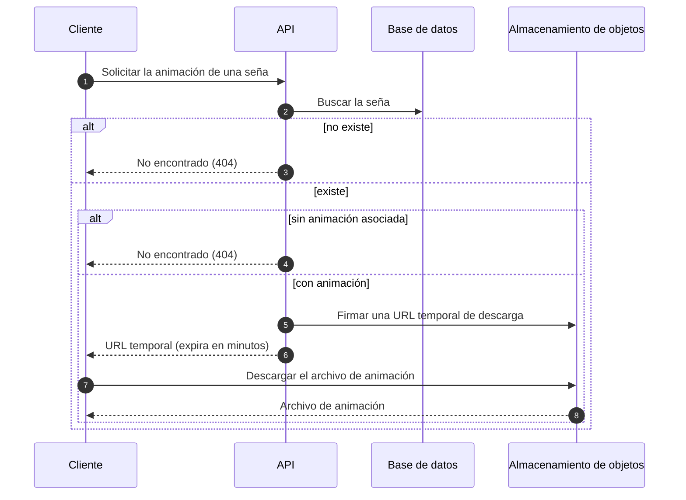
```mermaid
sequenceDiagram
    autonumber
    participant C as Cliente
    participant API as API
    participant DB as Base de datos
    participant OS as Almacenamiento de objetos

    C->>API: Solicitar la animación de una seña
    API->>DB: Buscar la seña
    alt no existe
        API-->>C: No encontrado (404)
    else existe
        alt sin animación asociada
            API-->>C: No encontrado (404)
        else con animación
            API->>OS: Firmar una URL temporal de descarga
            API-->>C: URL temporal (expira en minutos)
            C->>OS: Descargar el archivo de animación
            OS-->>C: Archivo de animación
        end
    end
```

## Tienda: reclamar un regalo

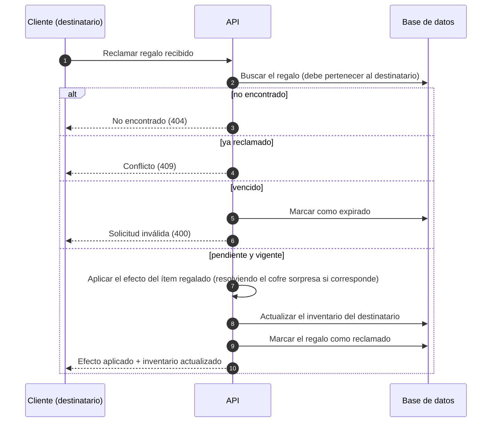
```mermaid
sequenceDiagram
    autonumber
    participant C as Cliente (destinatario)
    participant API as API
    participant DB as Base de datos

    C->>API: Reclamar regalo recibido
    API->>DB: Buscar el regalo (debe pertenecer al destinatario)
    alt no encontrado
        API-->>C: No encontrado (404)
    else ya reclamado
        API-->>C: Conflicto (409)
    else vencido
        API->>DB: Marcar como expirado
        API-->>C: Solicitud inválida (400)
    else pendiente y vigente
        API->>API: Aplicar el efecto del ítem regalado (resolviendo el cofre sorpresa si corresponde)
        API->>DB: Actualizar el inventario del destinatario
        API->>DB: Marcar el regalo como reclamado
        API-->>C: Efecto aplicado + inventario actualizado
    end
```

## Reclamo y activación de un potenciador

Una compra de la tienda pasa por hasta tres estados: **pendiente** (regalo sin reclamar),
**en inventario** (el ítem ya es del usuario) y **activada** (ya se consumió). Una compra para uno
mismo de gemas, vida, escudo de racha o cofre sorpresa aplica el efecto al instante y nace ya
**activada**; si es un potenciador temporal (vidas ilimitadas o multiplicador de XP) nace
directamente **en inventario**, sin pasar por pendiente, a la espera de que el usuario la active. El
regalo a un amigo es el único camino que nace **pendiente**: el destinatario lo reclama primero (pasa
a **en inventario**) y luego, si es un potenciador, lo activa. Ambos pasos se piden por `item_type`
(no por id de compra), tomando siempre la compra más antigua de ese tipo en el estado esperado
(FIFO).

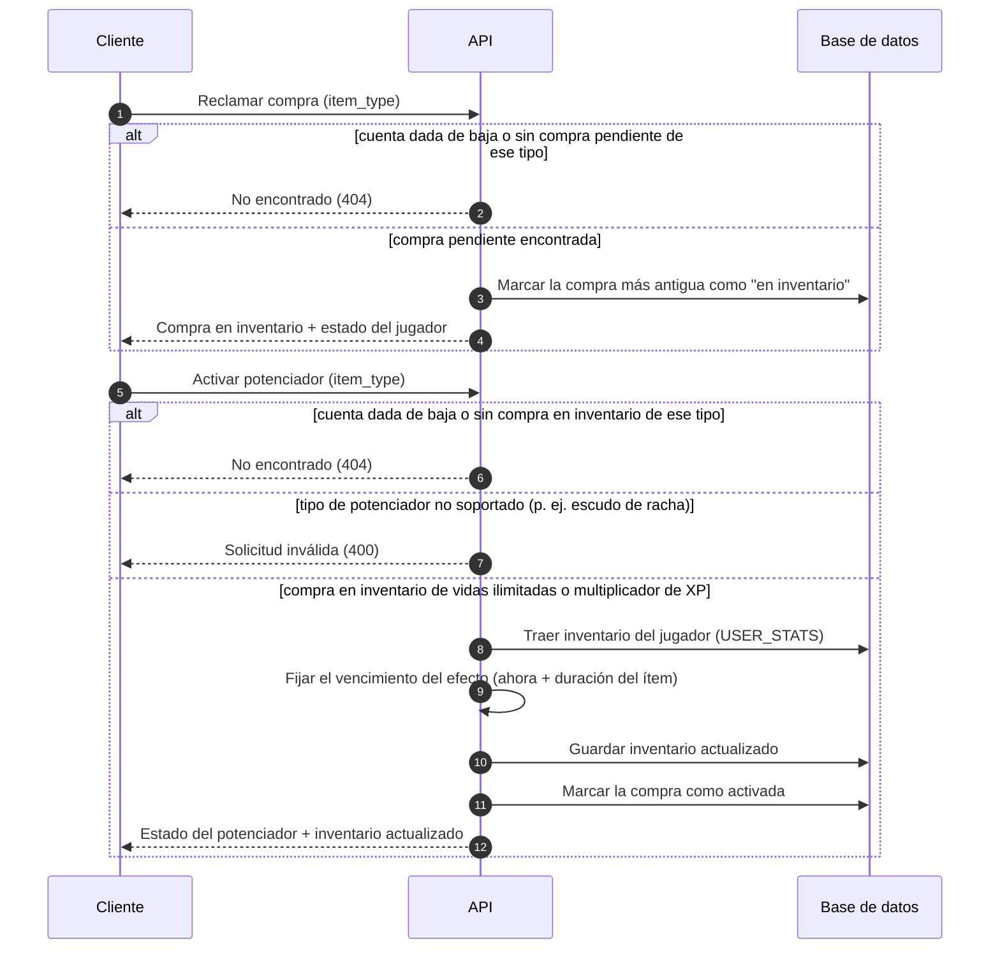
```mermaid
sequenceDiagram
    autonumber
    participant C as Cliente
    participant API as API
    participant DB as Base de datos

    C->>API: Reclamar compra (item_type)
    alt cuenta dada de baja o sin compra pendiente de ese tipo
        API-->>C: No encontrado (404)
    else compra pendiente encontrada
        API->>DB: Marcar la compra más antigua como "en inventario"
        API-->>C: Compra en inventario + estado del jugador
    end

    C->>API: Activar potenciador (item_type)
    alt cuenta dada de baja o sin compra en inventario de ese tipo
        API-->>C: No encontrado (404)
    else tipo de potenciador no soportado (p. ej. escudo de racha)
        API-->>C: Solicitud inválida (400)
    else compra en inventario de vidas ilimitadas o multiplicador de XP
        API->>DB: Traer inventario del jugador (USER_STATS)
        API->>API: Fijar el vencimiento del efecto (ahora + duración del ítem)
        API->>DB: Guardar inventario actualizado
        API->>DB: Marcar la compra como activada
        API-->>C: Estado del potenciador + inventario actualizado
    end
```

## Importación de contenido

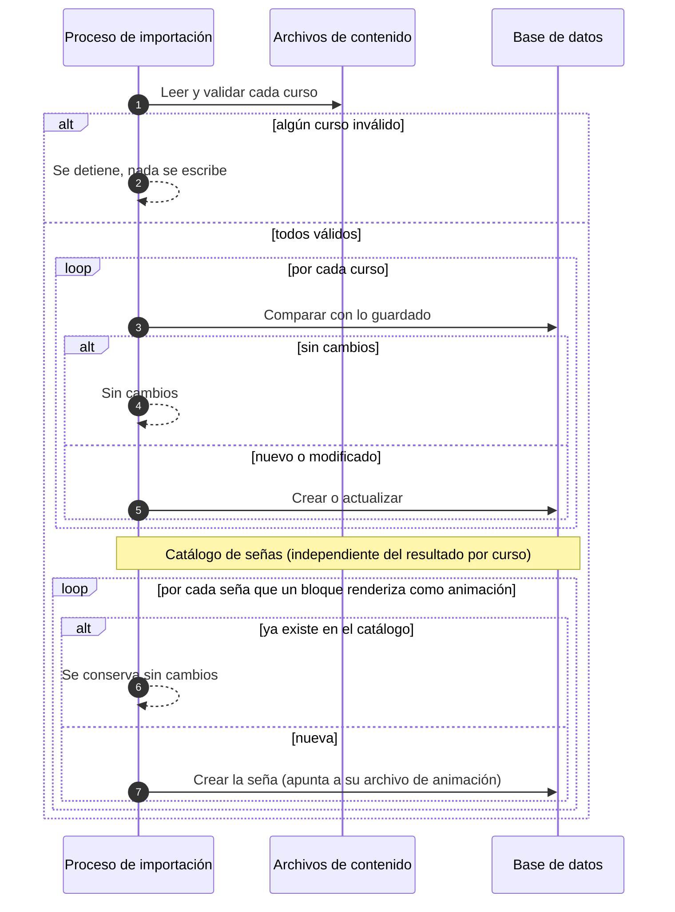
```mermaid
sequenceDiagram
    autonumber
    participant P as Proceso de importación
    participant F as Archivos de contenido
    participant DB as Base de datos

    P->>F: Leer y validar cada curso
    alt algún curso inválido
        P-->>P: Se detiene, nada se escribe
    else todos válidos
        loop por cada curso
            P->>DB: Comparar con lo guardado
            alt sin cambios
                P-->>P: Sin cambios
            else nuevo o modificado
                P->>DB: Crear o actualizar
            end
        end
        Note over P,DB: Catálogo de señas (independiente del resultado por curso)
        loop por cada seña que un bloque renderiza como animación
            alt ya existe en el catálogo
                P-->>P: Se conserva sin cambios
            else nueva
                P->>DB: Crear la seña (apunta a su archivo de animación)
            end
        end
    end
```
