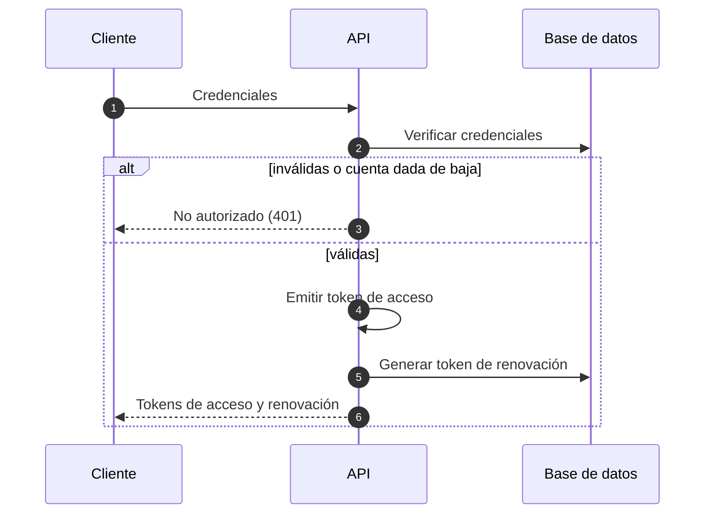
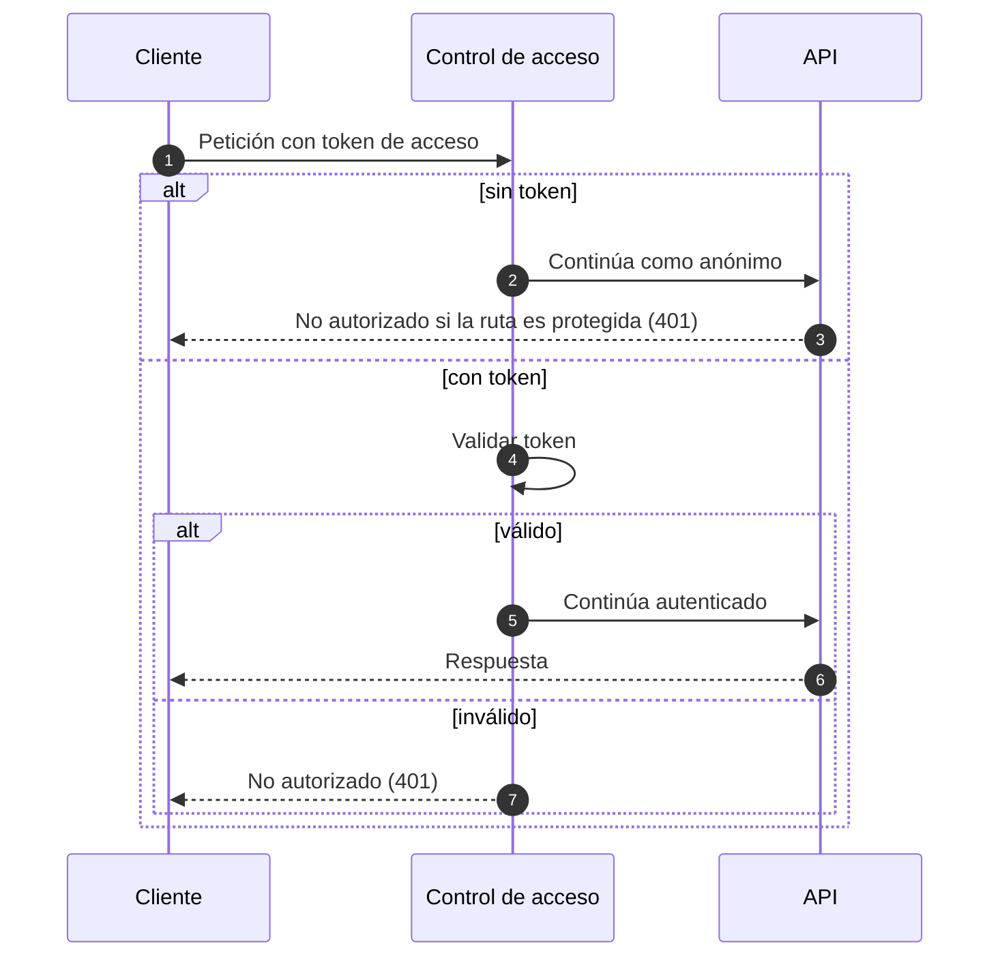
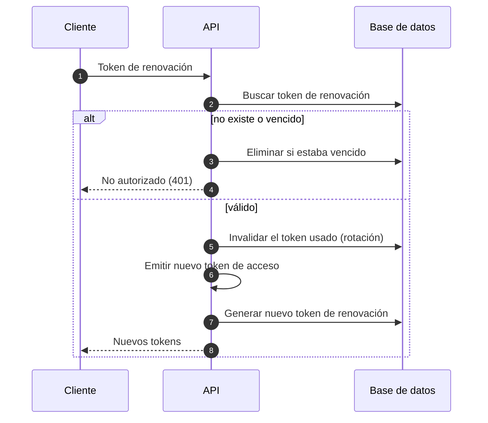
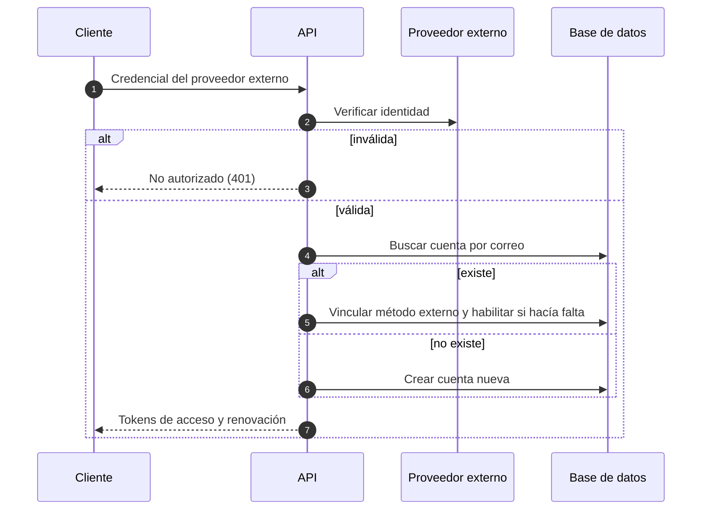
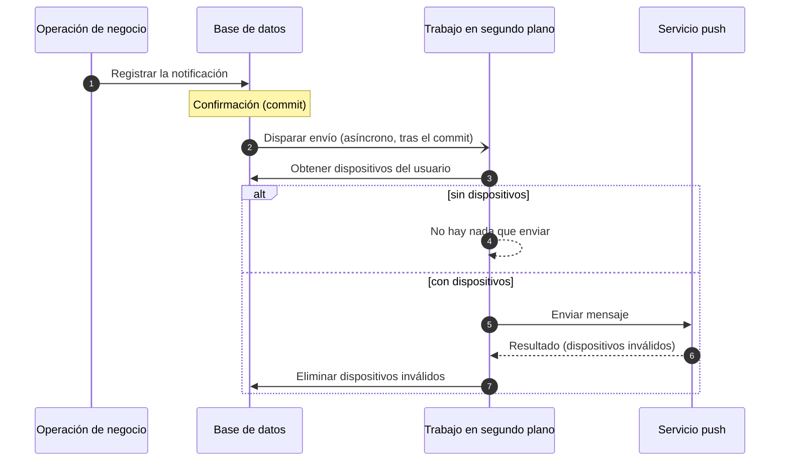
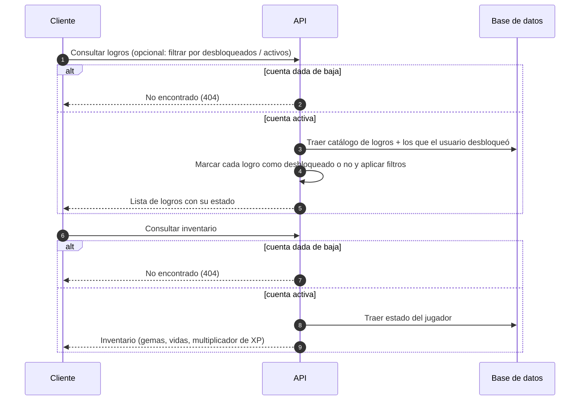
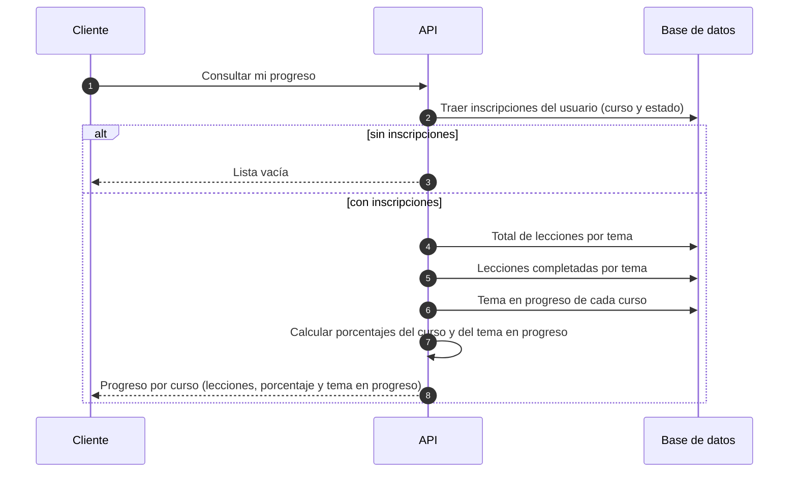
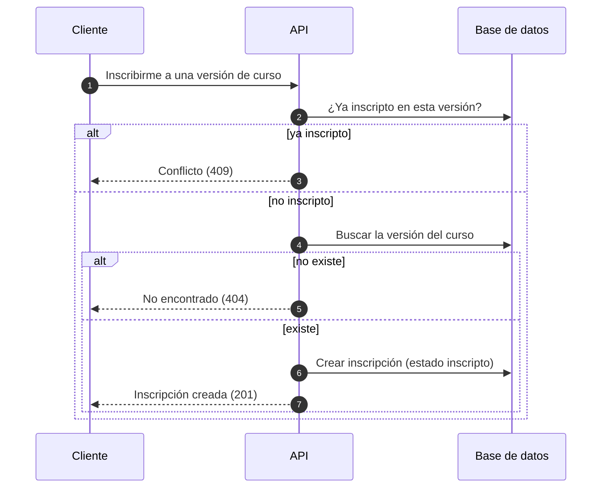
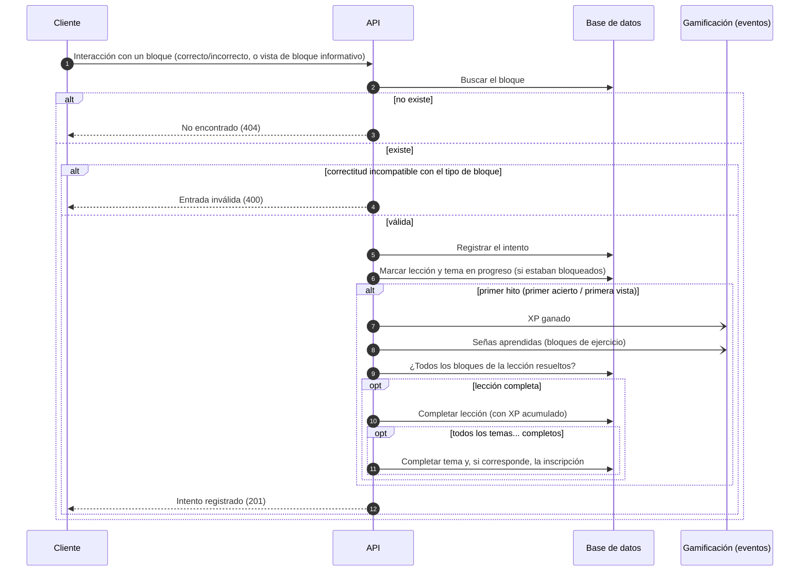
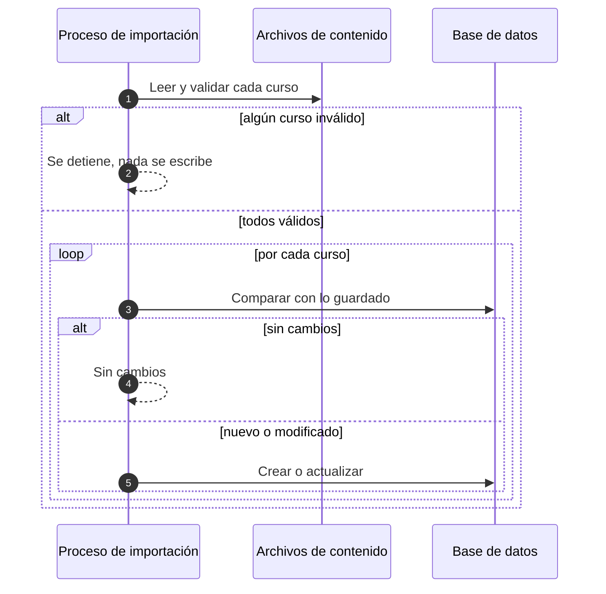

# Diagramas de secuencia

Flujos dinámicos de los casos de uso principales, descritos a nivel de responsabilidades (no de
componentes concretos del código).

## Registro de usuario

```mermaid
sequenceDiagram
    autonumber
    participant C as Cliente
    participant API as API
    participant DB as Base de datos
    participant Mail as Servicio de correo

    C->>API: Solicitud de registro
    API->>DB: ¿Correo o usuario ya registrados?
    alt ya existe
        API-->>C: Conflicto (409)
    else disponible
        API->>DB: Crear cuenta (activa, correo sin verificar, contraseña cifrada)
        API->>DB: Generar token de verificación
        API->>Mail: Enviar correo de verificación
        API->>API: Emitir token de acceso
        API->>DB: Generar token de renovación
        API-->>C: Registro exitoso + tokens (sesión iniciada; verificar correo es opcional)
    end
```

## Inicio de sesión



## Petición autenticada



## Renovación de token (rotación)



## Inicio de sesión con proveedor externo



## Envío de notificación push



## Consulta de logros e inventario



## Consulta de progreso de cursos



## Inscripción a un curso



## Interacción con un bloque de lección

Registra el intento del usuario y propaga la finalización hacia arriba en la jerarquía
(lección → tema → curso). El XP y demás recompensas de gamificación se disparan por eventos, fuera
del camino principal. El progreso de lección y tema se crea de forma diferida en la primera
interacción.



## Importación de contenido


