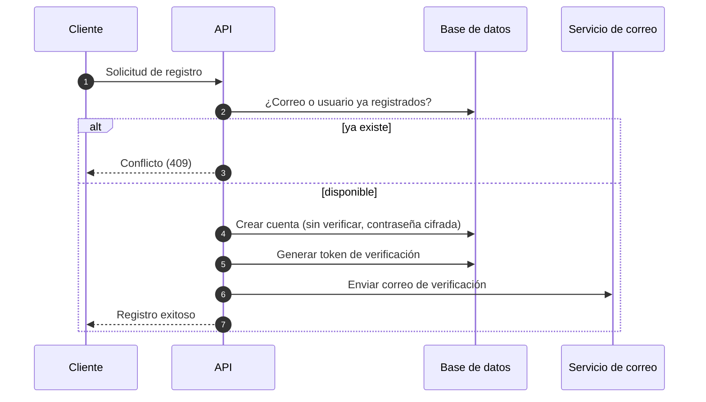
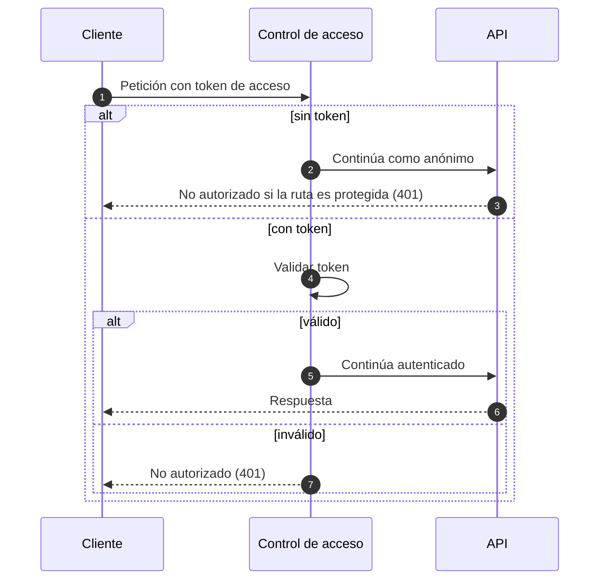
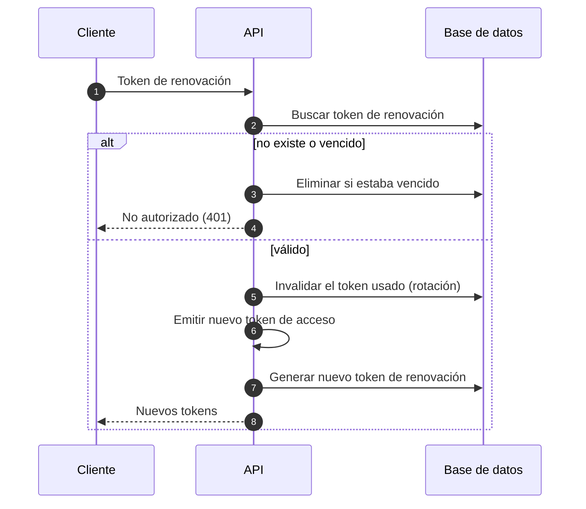
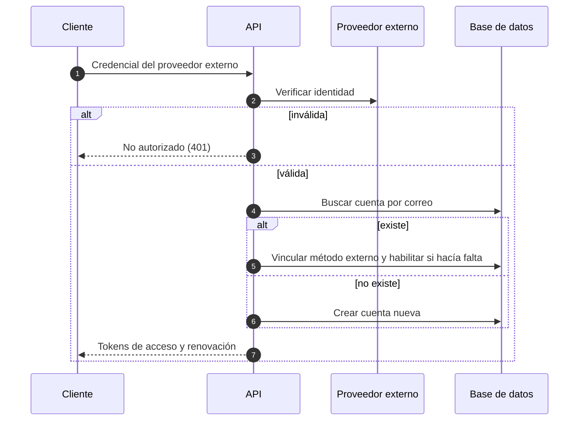
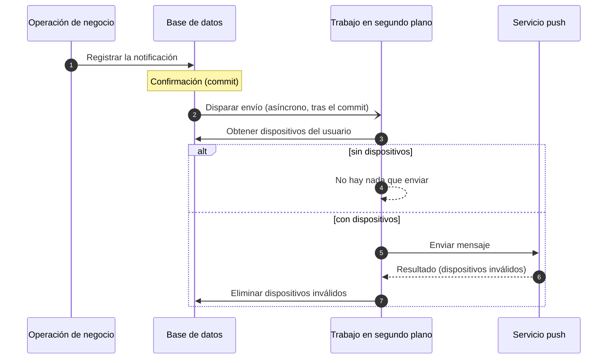
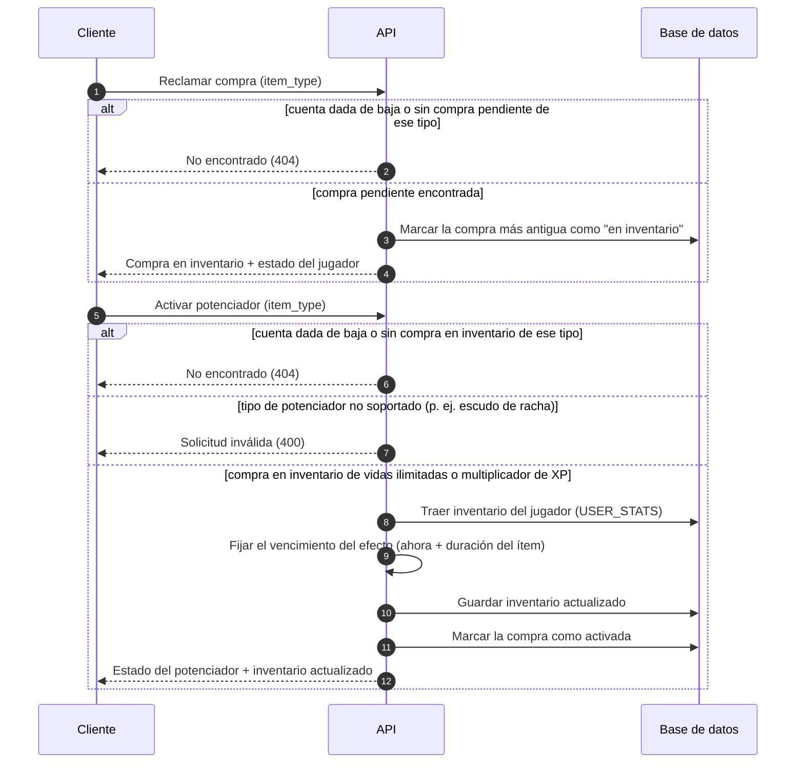
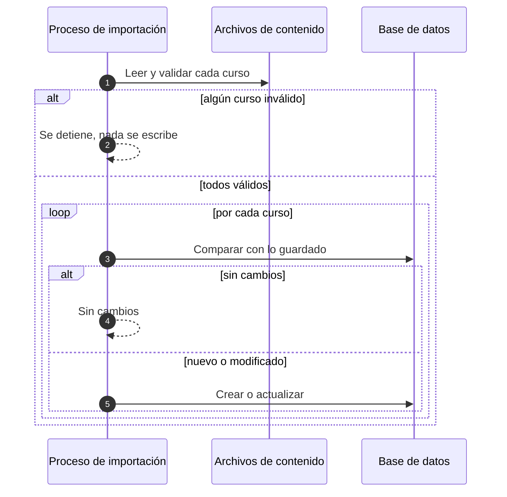

# Diagramas de secuencia

Flujos dinámicos de los casos de uso principales, descritos a nivel de responsabilidades (no de
componentes concretos del código).

## Registro de usuario



## Inicio de sesión


## Petición autenticada



## Renovación de token (rotación)



## Inicio de sesión con proveedor externo



## Envío de notificación push



## Consulta de logros e inventario

```mermaid
sequenceDiagram
    autonumber
    participant C as Cliente
    participant API as API
    participant DB as Base de datos

    C->>API: Solicitud de logros (opcional: filtrar por desbloqueados / activos)
    alt cuenta dada de baja
        API-->>C: No encontrado (404)
    else cuenta activa
        API->>DB: Traer catálogo de logros + los que el usuario desbloqueó
        API->>API: Marcar cada logro como desbloqueado o no; aplicar filtros
        API-->>C: Lista de logros con su estado
    end
    Note over C,DB: El inventario (gemas, vidas, multiplicador de XP) sigue el mismo<br/>guard de cuenta activa y devuelve el estado del jugador.
```

## Reclamo y activación de un potenciador

Toda compra nace **pendiente** (regalo sin reclamar). El cliente primero la reclama (queda **en
inventario**, propiedad del usuario) y luego la activa; hoy ambos pasos se piden por
`item_type` (no por id de compra), tomando siempre la compra más antigua pendiente/en inventario de
ese tipo (FIFO). Cuando la recompensa ya está pagada (p. ej. un cofre sorpresa) el cliente encadena
las dos llamadas una detrás de la otra. Sólo se activan manualmente los potenciadores temporales
(vidas ilimitadas y multiplicador de XP): el escudo de racha y la regeneración de vidas se aplican en
otros flujos (cuando la racha está por romperse, cuando se gasta una vida), no a través de este
endpoint — pero sí pueden reclamarse.



## Importación de contenido


