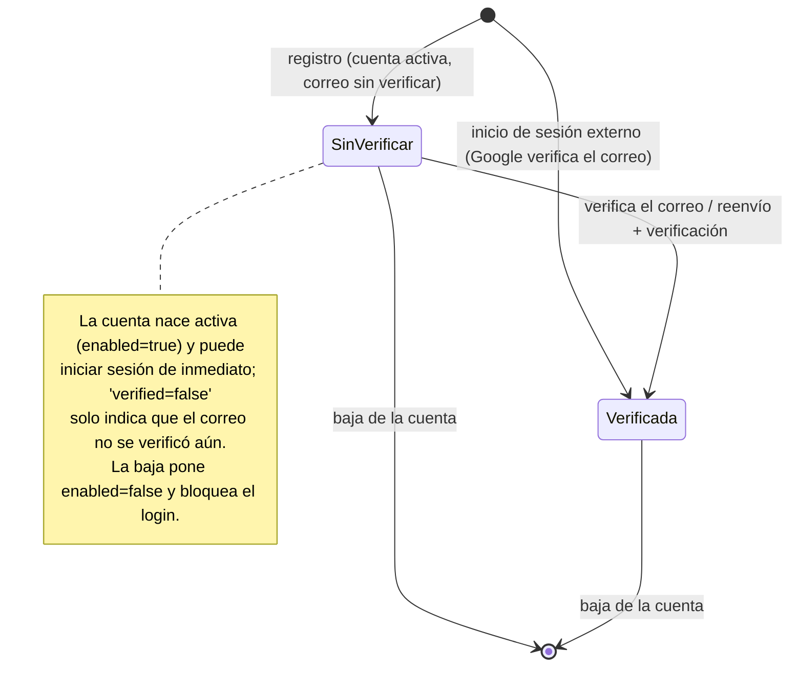
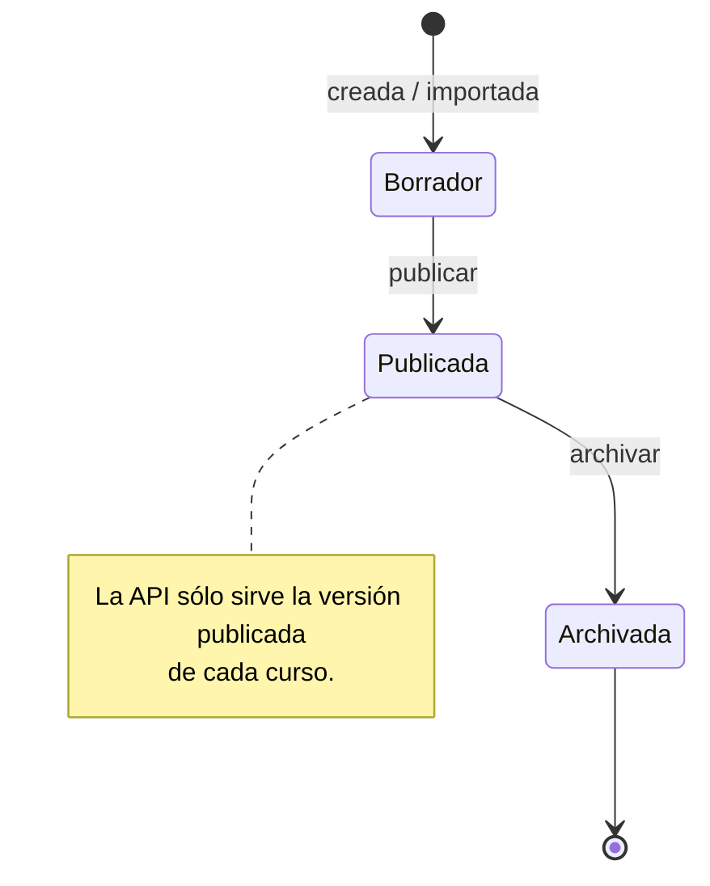
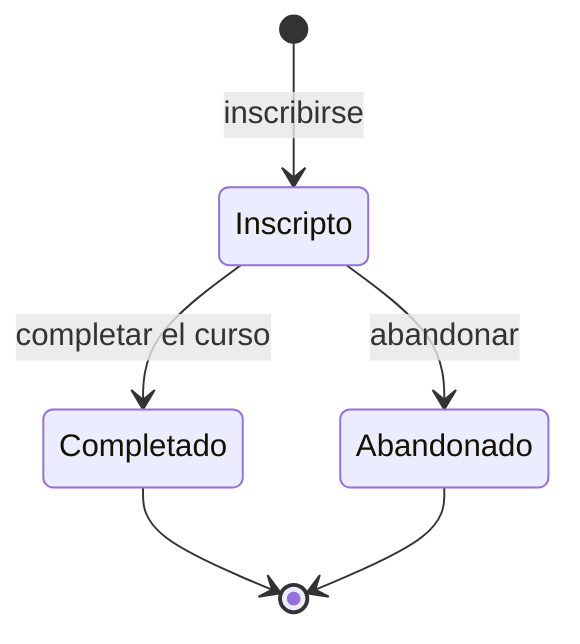
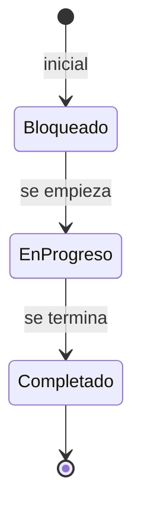
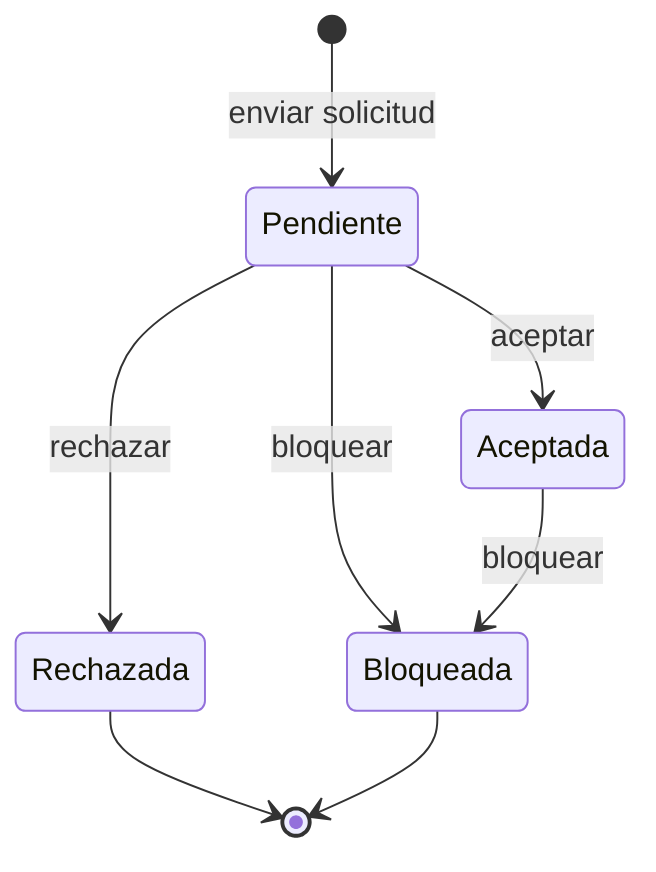
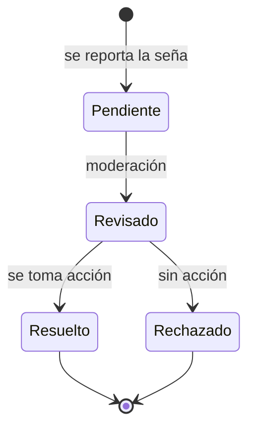
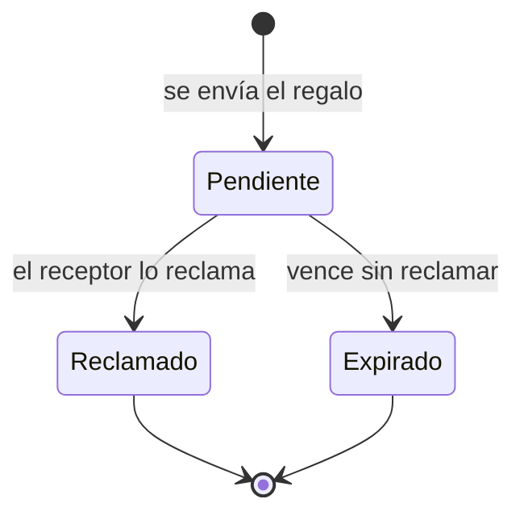
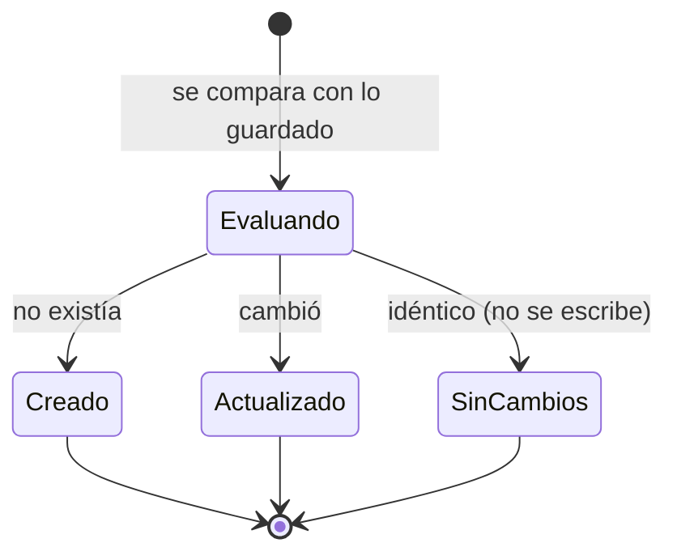

# Diagramas de estados

Ciclo de vida de las entidades que tienen estados relevantes.

## Cuenta de usuario

## Versión de un curso

## Inscripción a un curso

## Progreso de tema y de lección

Mismo ciclo para el avance de un tema y de una lección.

## Solicitud de amistad

## Reporte de una seña

## Regalo entre usuarios

## Resultado de la incorporación de contenido

