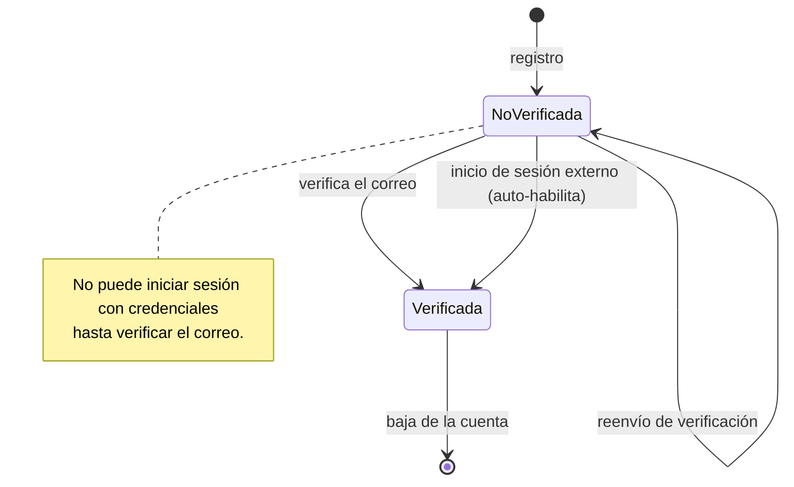
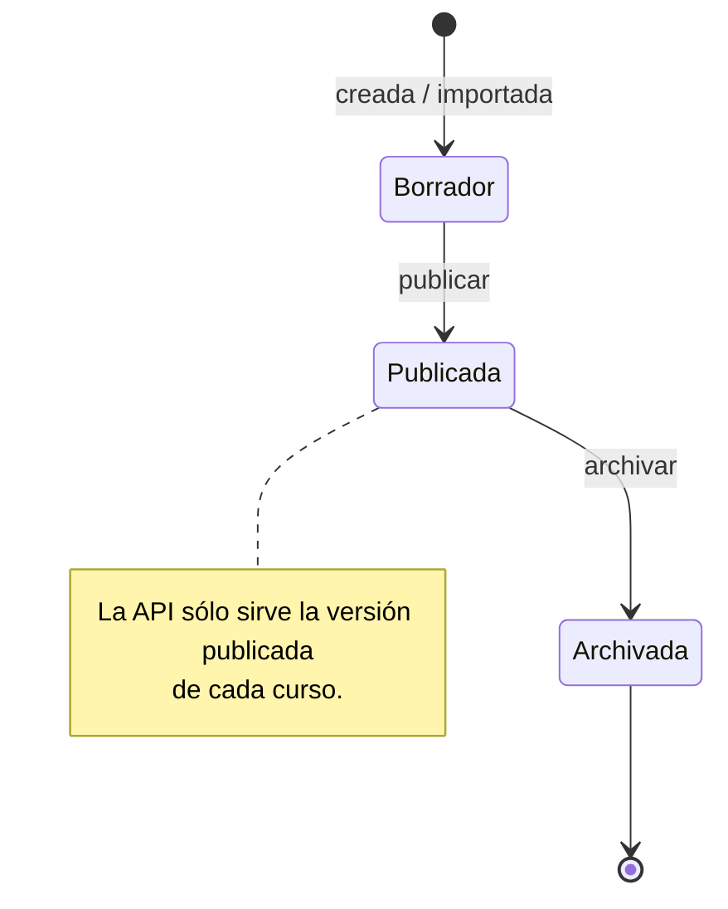
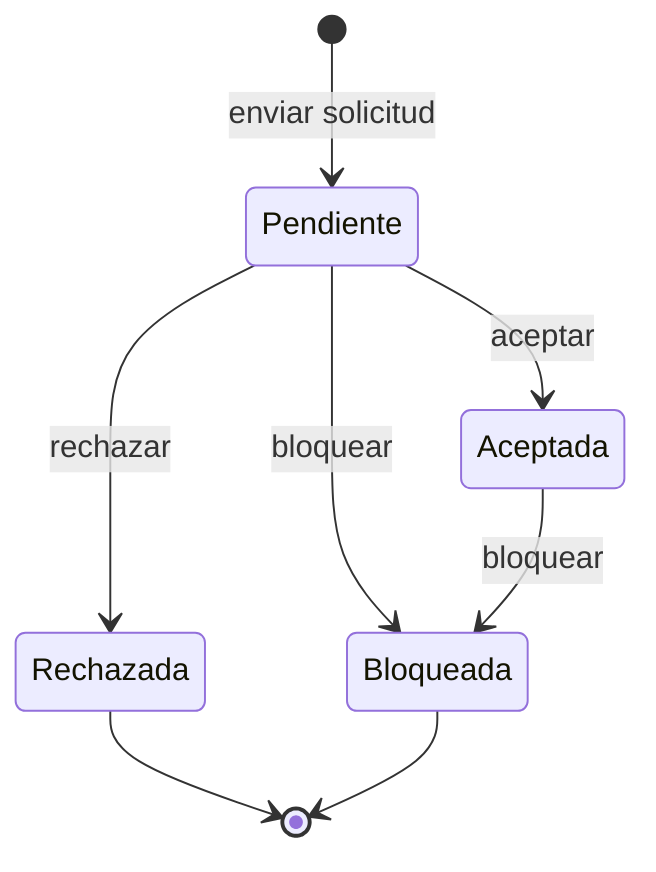
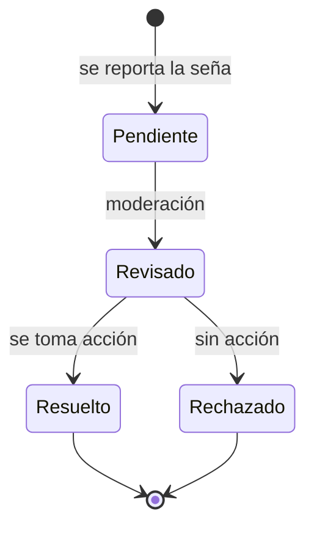
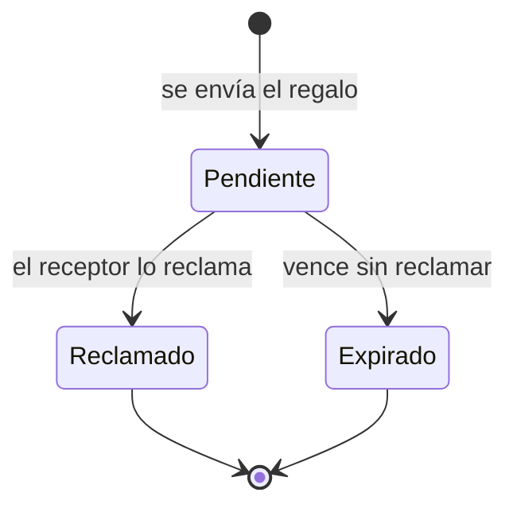
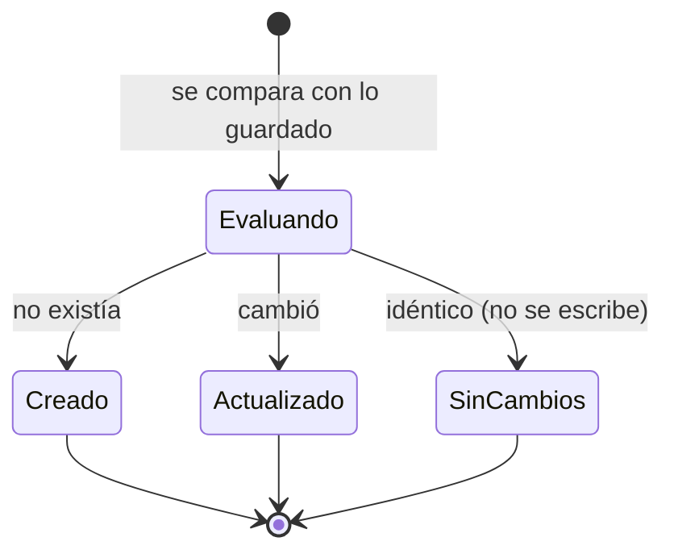

# Diagramas de estados

Ciclo de vida de las entidades que tienen estados relevantes.

## Cuenta de usuario

## Versión de un curso

## Solicitud de amistad

## Reporte de una seña

## Regalo entre usuarios

## Resultado de la incorporación de contenido

