# Diagramas de estados

Ciclo de vida de las entidades que tienen estados relevantes.

## Cuenta de usuario

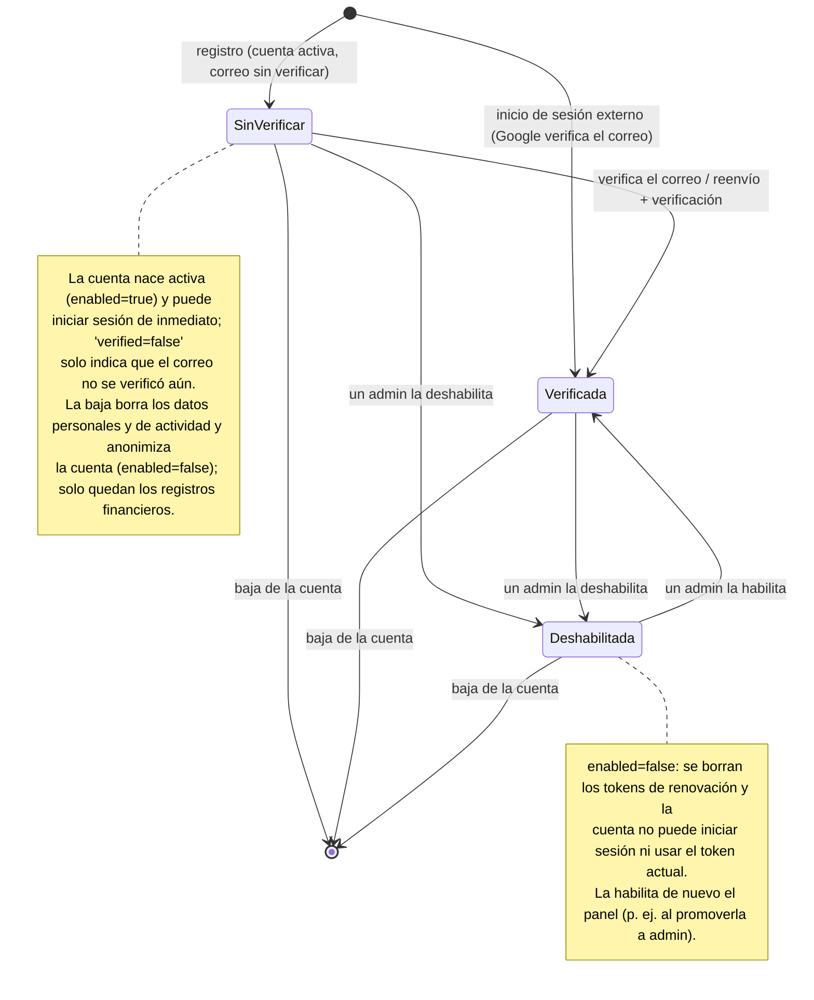
```mermaid
stateDiagram-v2
    [*] --> SinVerificar : registro (cuenta activa, correo sin verificar)
    [*] --> Verificada : inicio de sesión externo (Google verifica el correo)
    SinVerificar --> Verificada : verifica el correo / reenvío + verificación
    SinVerificar --> Deshabilitada : un admin la deshabilita
    Verificada --> Deshabilitada : un admin la deshabilita
    Deshabilitada --> Verificada : un admin la habilita
    SinVerificar --> [*] : baja de la cuenta
    Verificada --> [*] : baja de la cuenta
    Deshabilitada --> [*] : baja de la cuenta
    note right of Deshabilitada
        enabled=false: se borran los tokens de renovación y la
        cuenta no puede iniciar sesión ni usar el token actual.
        La habilita de nuevo el panel (p. ej. al promoverla a admin).
    end note
    note right of SinVerificar
        La cuenta nace activa (enabled=true) y puede
        iniciar sesión de inmediato; 'verified=false'
        solo indica que el correo no se verificó aún.
        La baja borra los datos personales y de actividad y anonimiza
        la cuenta (enabled=false); solo quedan los registros financieros.
    end note
```

## Versión de un curso

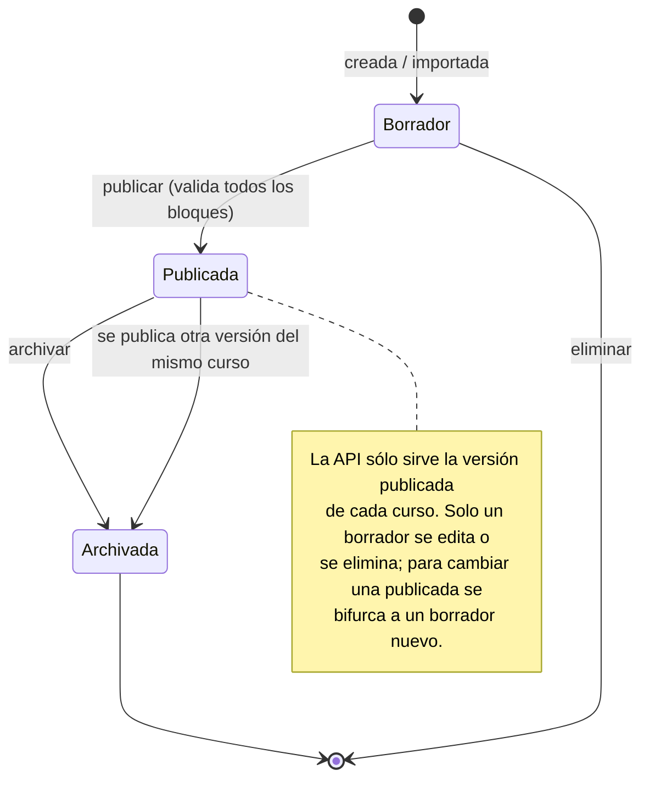
```mermaid
stateDiagram-v2
    [*] --> Borrador : creada / importada
    Borrador --> Publicada : publicar (valida todos los bloques)
    Borrador --> [*] : eliminar
    Publicada --> Archivada : archivar
    Publicada --> Archivada : se publica otra versión del mismo curso
    Archivada --> [*]
    note right of Publicada
        La API sólo sirve la versión publicada
        de cada curso. Solo un borrador se edita o
        se elimina; para cambiar una publicada se
        bifurca a un borrador nuevo.
    end note
```

## Inscripción a un curso

Por cuenta propia sólo se puede inscribir en cursos gratuitos. A los pagos se llega de dos maneras:
a través de una organización (acceso con vencimiento, según los días del cupo) o comprándolos
uno mismo (acceso permanente). Una inscripción vencida deja de dar acceso aunque siga en `Inscripto`;
el progreso queda a la vista.

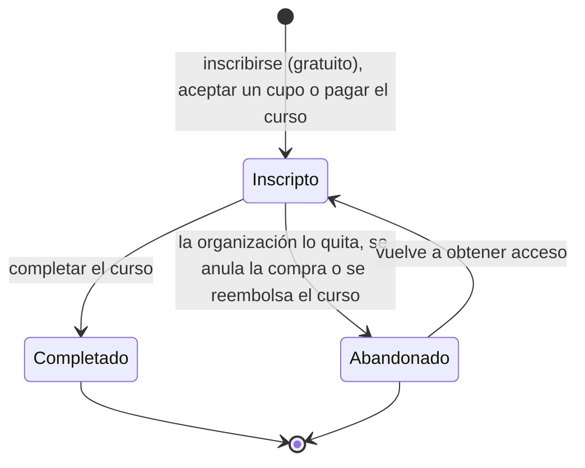
```mermaid
stateDiagram-v2
    [*] --> Inscripto : inscribirse (gratuito), aceptar un cupo o pagar el curso
    Inscripto --> Completado : completar el curso
    Inscripto --> Abandonado : la organización lo quita, se anula la compra o se reembolsa el curso
    Abandonado --> Inscripto : vuelve a obtener acceso
    Completado --> [*]
    Abandonado --> [*]
```

## Organización

Las que crea SIGNA nacen activas; las que se registran solas desde la web quedan pendientes hasta
que SIGNA valida desde su panel que quien las registró las representa. Aprobar ya no contrata
cursos: la organización los compra después, por cupos. Mientras no esté activa, su administrador
puede entrar al panel, pero no puede comprar. Suspender exige un motivo, que se guarda y se borra al
reactivar. SIGNA puede dar de baja una organización rechazada o suspendida siempre que no tenga
compras.

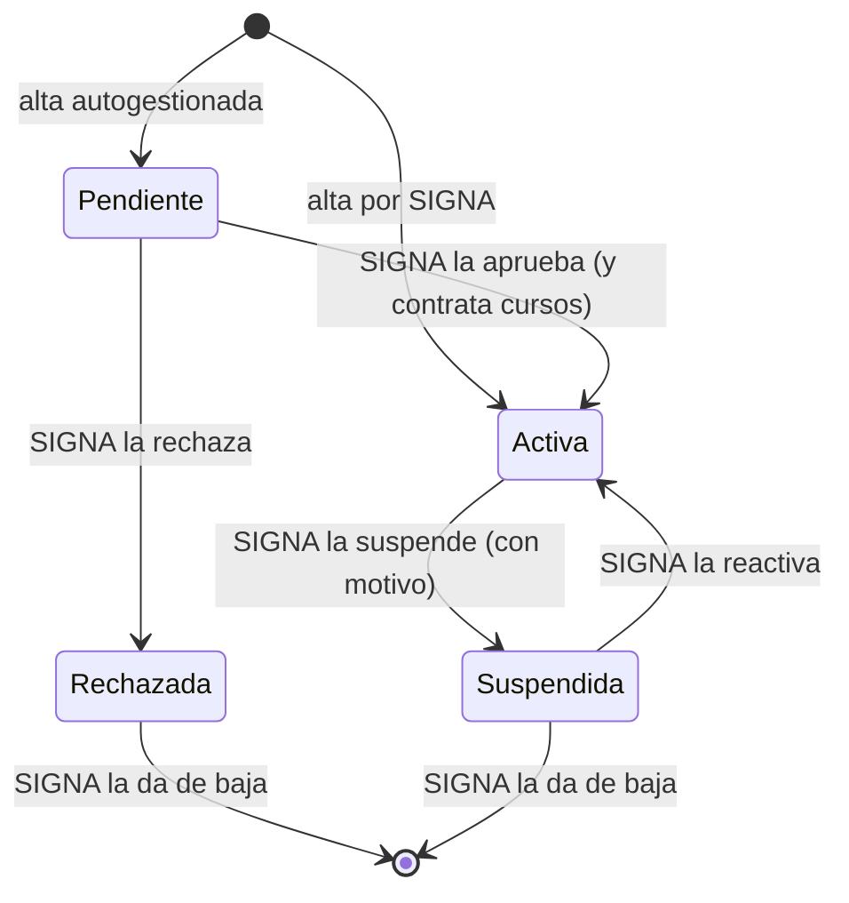
```mermaid
stateDiagram-v2
    [*] --> Pendiente : alta autogestionada
    [*] --> Activa : alta por SIGNA
    Pendiente --> Activa : SIGNA la aprueba (y contrata cursos)
    Pendiente --> Rechazada : SIGNA la rechaza
    Activa --> Suspendida : SIGNA la suspende (con motivo)
    Suspendida --> Activa : SIGNA la reactiva
    Rechazada --> [*] : SIGNA la da de baja
    Suspendida --> [*] : SIGNA la da de baja
```

## Membresía en una organización

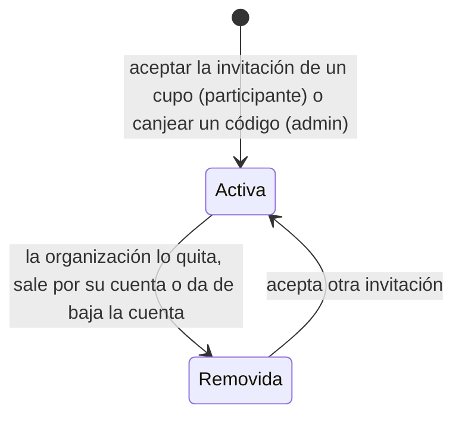
```mermaid
stateDiagram-v2
    [*] --> Activa : aceptar la invitación de un cupo (participante) o canjear un código (admin)
    Activa --> Removida : la organización lo quita, sale por su cuenta o da de baja la cuenta
    Removida --> Activa : acepta otra invitación
```

Un usuario pertenece a una sola organización. Al quedar `Removida` sus cupos activos pasan a
`Revocado` y sus inscripciones a cursos pagos a `Abandonado`; el progreso se conserva.

## Progreso de tema y de lección

Mismo ciclo para el avance de un tema y de una lección.

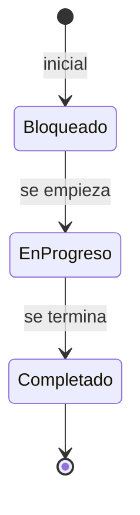
```mermaid
stateDiagram-v2
    [*] --> Bloqueado : inicial
    Bloqueado --> EnProgreso : se empieza
    EnProgreso --> Completado : se termina
    Completado --> [*]
```

## Solicitud de amistad

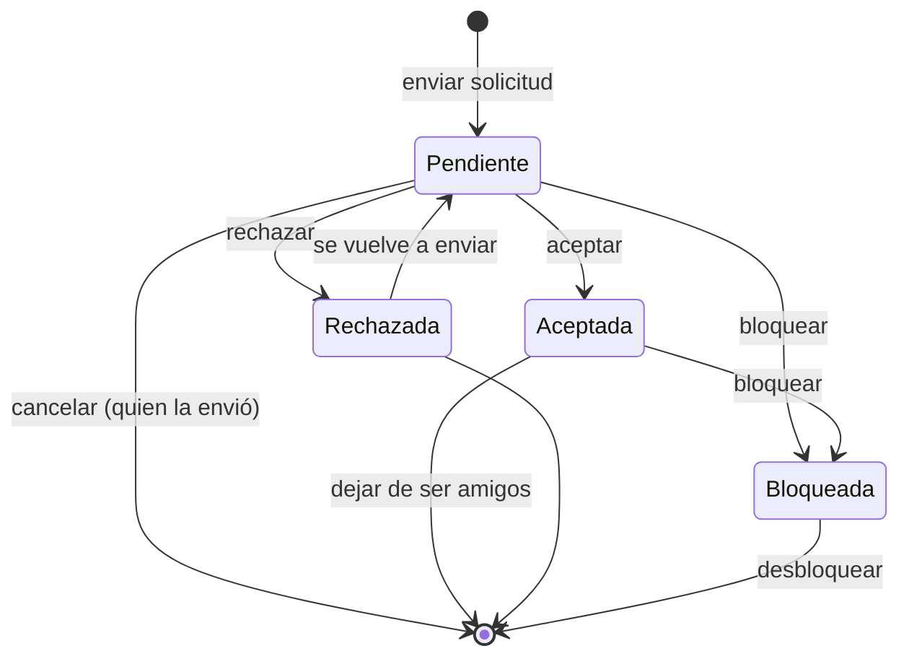
```mermaid
stateDiagram-v2
    [*] --> Pendiente : enviar solicitud
    Pendiente --> Aceptada : aceptar
    Pendiente --> Rechazada : rechazar
    Pendiente --> Bloqueada : bloquear
    Pendiente --> [*] : cancelar (quien la envió)
    Aceptada --> [*] : dejar de ser amigos
    Aceptada --> Bloqueada : bloquear
    Rechazada --> Pendiente : se vuelve a enviar
    Rechazada --> [*]
    Bloqueada --> [*] : desbloquear
```

Cancelar, dejar de ser amigos y desbloquear **borran** la relación, así que las dos personas
vuelven a partir de cero. Una solicitud rechazada, en cambio, se conserva y se reutiliza si alguien
vuelve a enviarla.

## Reporte de una seña

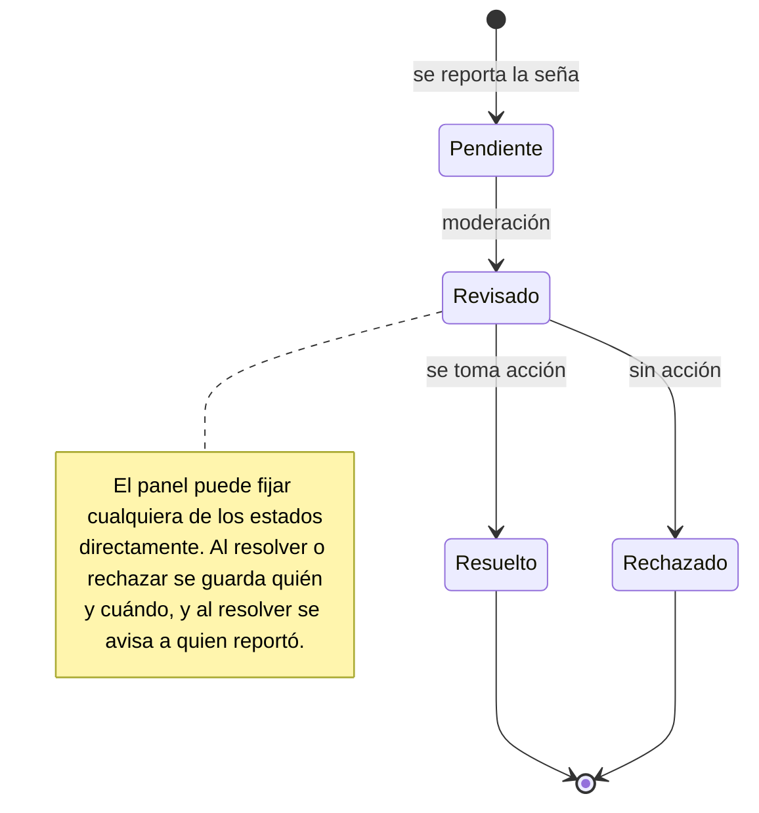
```mermaid
stateDiagram-v2
    [*] --> Pendiente : se reporta la seña
    Pendiente --> Revisado : moderación
    Revisado --> Resuelto : se toma acción
    Revisado --> Rechazado : sin acción
    Resuelto --> [*]
    Rechazado --> [*]
    note right of Revisado
        El panel puede fijar cualquiera de los estados
        directamente. Al resolver o rechazar se guarda quién
        y cuándo, y al resolver se avisa a quien reportó.
    end note
```

## Regalo entre usuarios

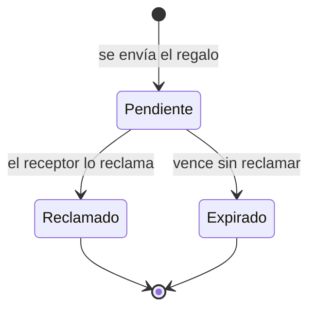
```mermaid
stateDiagram-v2
    [*] --> Pendiente : se envía el regalo
    Pendiente --> Reclamado : el receptor lo reclama
    Pendiente --> Expirado : vence sin reclamar
    Reclamado --> [*]
    Expirado --> [*]
```

## Ítem comprado o regalado

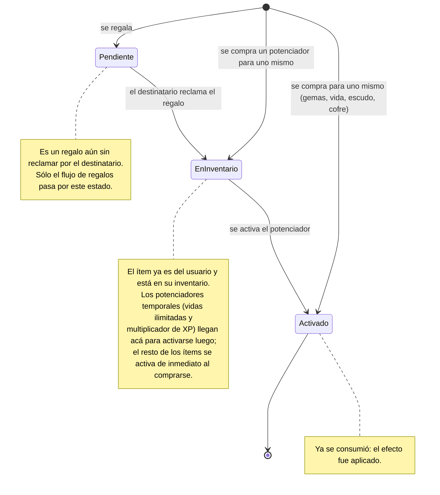
```mermaid
stateDiagram-v2
    [*] --> Pendiente : se regala
    [*] --> EnInventario : se compra un potenciador para uno mismo
    [*] --> Activado : se compra para uno mismo (gemas, vida, escudo, cofre)
    Pendiente --> EnInventario : el destinatario reclama el regalo
    EnInventario --> Activado : se activa el potenciador
    Activado --> [*]
    note right of Pendiente
        Es un regalo aún sin reclamar por el destinatario.
        Sólo el flujo de regalos pasa por este estado.
    end note
    note right of EnInventario
        El ítem ya es del usuario y está en su inventario.
        Los potenciadores temporales (vidas ilimitadas y
        multiplicador de XP) llegan acá para activarse luego;
        el resto de los ítems se activa de inmediato al comprarse.
    end note
    note right of Activado
        Ya se consumió: el efecto fue aplicado.
    end note
```

## Compra de cupos de una organización

Solo una organización activa compra. El pago se confirma únicamente releyendo la order en Mercado
Pago (webhook o sync del panel). Un reembolso desde Mercado Pago, un contracargo o el arrepentimiento
dentro de los 10 días anulan una compra pagada: la compra pasa a `Reembolsada` y se revocan sus
cupos.

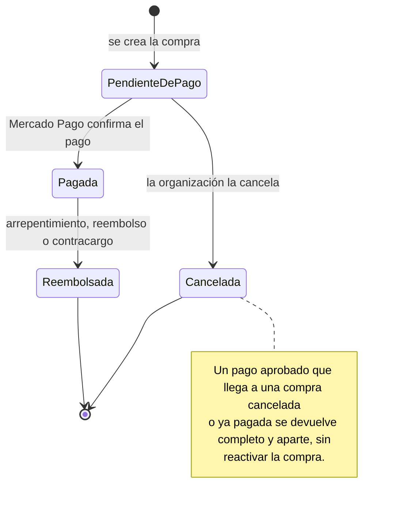
```mermaid
stateDiagram-v2
    [*] --> PendienteDePago : se crea la compra
    PendienteDePago --> Pagada : Mercado Pago confirma el pago
    PendienteDePago --> Cancelada : la organización la cancela
    Pagada --> Reembolsada : arrepentimiento, reembolso o contracargo
    Cancelada --> [*]
    Reembolsada --> [*]
    note right of Cancelada
        Un pago aprobado que llega a una compra cancelada
        o ya pagada se devuelve completo y aparte, sin
        reactivar la compra.
    end note
```

## Cupo de una compra

`Invitación vencida` y `Acceso vencido` no se guardan: se derivan de las fechas. Un cupo vencido no
se reasigna.

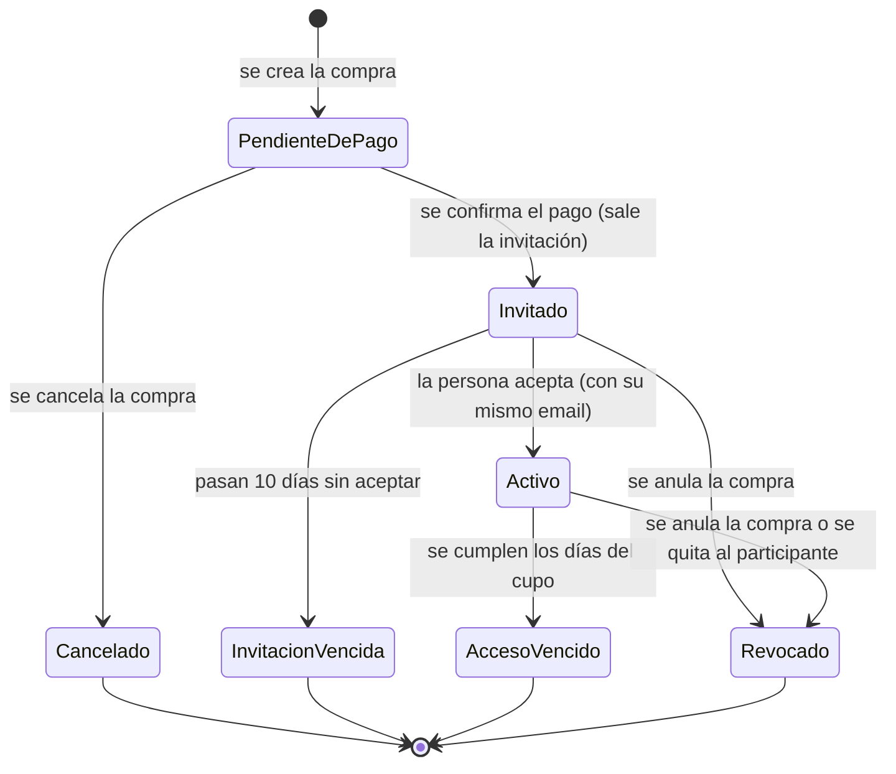
```mermaid
stateDiagram-v2
    [*] --> PendienteDePago : se crea la compra
    PendienteDePago --> Invitado : se confirma el pago (sale la invitación)
    PendienteDePago --> Cancelado : se cancela la compra
    Invitado --> Activo : la persona acepta (con su mismo email)
    Invitado --> InvitacionVencida : pasan 10 días sin aceptar
    Invitado --> Revocado : se anula la compra
    Activo --> AccesoVencido : se cumplen los días del cupo
    Activo --> Revocado : se anula la compra o se quita al participante
    Cancelado --> [*]
    InvitacionVencida --> [*]
    AccesoVencido --> [*]
    Revocado --> [*]
```

## Reembolso de una compra de cupos

Es el registro de cada devolución hecha en Mercado Pago. Nace pendiente y solo pasa a reembolsado
cuando Mercado Pago confirma; si falla queda pendiente y se completa al reintentar o cuando llega la
notificación del pago devuelto.

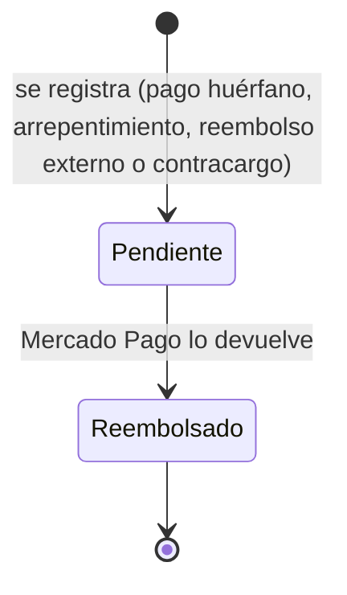
```mermaid
stateDiagram-v2
    [*] --> Pendiente : se registra (pago huérfano, arrepentimiento, reembolso externo o contracargo)
    Pendiente --> Reembolsado : Mercado Pago lo devuelve
    Reembolsado --> [*]
```

## Orden de gemas o de curso

Las dos órdenes de usuarios finales siguen el mismo ciclo. El precio queda congelado al crearlas y
solo se acredita (gemas o acceso al curso) al pasar a `Pagada`, después de releer la order en
Mercado Pago.

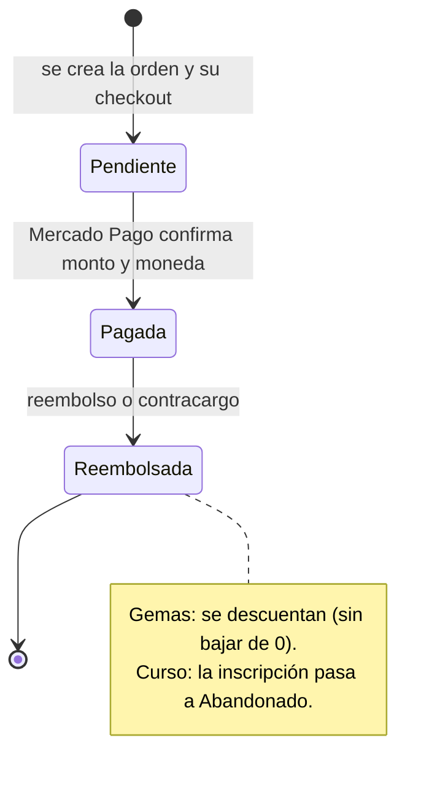
```mermaid
stateDiagram-v2
    [*] --> Pendiente : se crea la orden y su checkout
    Pendiente --> Pagada : Mercado Pago confirma monto y moneda
    Pagada --> Reembolsada : reembolso o contracargo
    Reembolsada --> [*]
    note right of Reembolsada
        Gemas: se descuentan (sin bajar de 0).
        Curso: la inscripción pasa a Abandonado.
    end note
```

## Pedido de reembolso

Es una señal para el equipo, no una devolución automática. Solo se puede pedir sobre una compra
pagada y elegible (gemas sin gastar, curso sin la primera lección completada, cupos sin
participantes activos), y no puede haber dos pendientes para la misma compra.

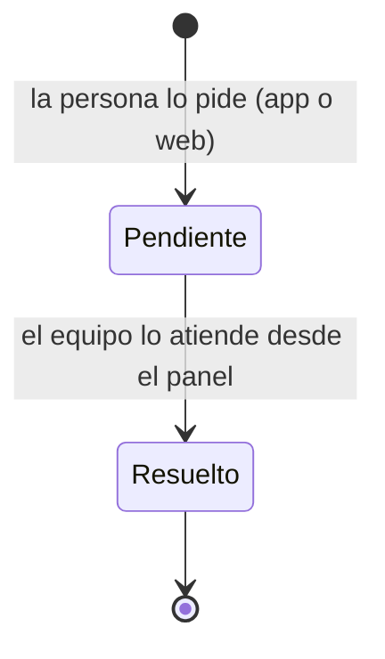
```mermaid
stateDiagram-v2
    [*] --> Pendiente : la persona lo pide (app o web)
    Pendiente --> Resuelto : el equipo lo atiende desde el panel
    Resuelto --> [*]
```

## Desafío de un usuario

Las filas se crean al consultar los desafíos, una por período (día o semana argentinos; los
primeros pasos son únicos). El progreso lo reportan las acciones del usuario y la recompensa se
acredita recién al reclamarla.

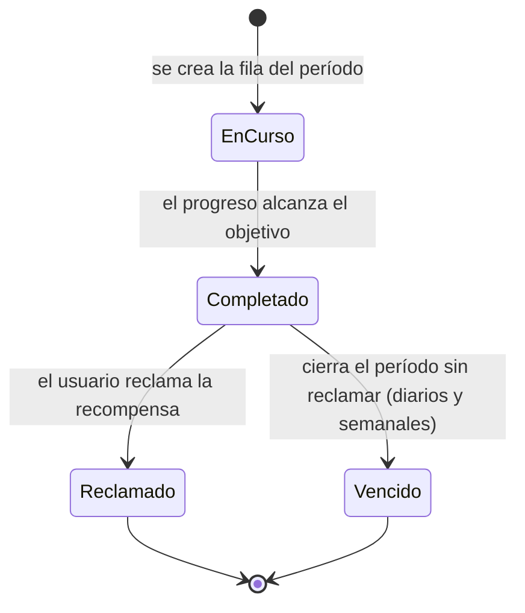
```mermaid
stateDiagram-v2
    [*] --> EnCurso : se crea la fila del período
    EnCurso --> Completado : el progreso alcanza el objetivo
    Completado --> Reclamado : el usuario reclama la recompensa
    Completado --> Vencido : cierra el período sin reclamar (diarios y semanales)
    Reclamado --> [*]
    Vencido --> [*]
```

## Resultado de la incorporación de contenido

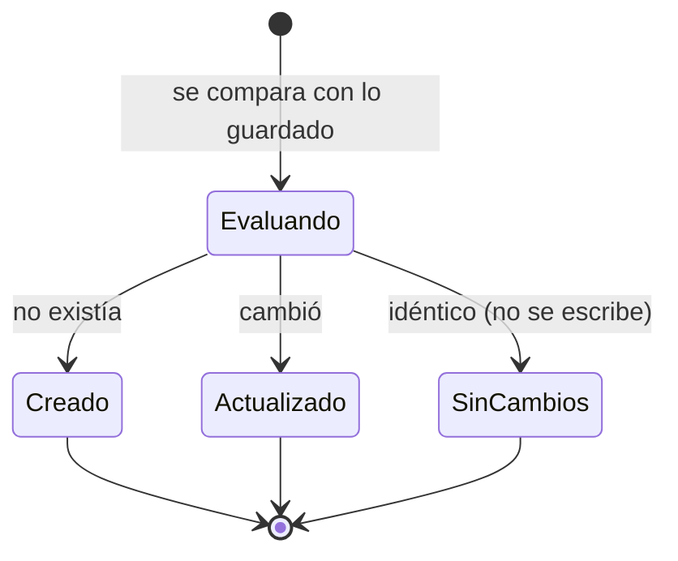
```mermaid
stateDiagram-v2
    [*] --> Evaluando : se compara con lo guardado
    Evaluando --> Creado : no existía
    Evaluando --> Actualizado : cambió
    Evaluando --> SinCambios : idéntico (no se escribe)
    Creado --> [*]
    Actualizado --> [*]
    SinCambios --> [*]
```
